# Food Operations Platform — Authoritative Architecture & Implementation Specification

**Document status:** V1 architecture freeze  
**Version:** 1.0  
**Date:** 2026-09-07  
**Primary implementation target:** Portfolio-grade V1  
**Repository target:** `food-ops-platform`

> **This specification is authoritative. The implementation must conform to it.**
>
> Do not introduce features, architectural patterns, database entities, permissions, business rules, lifecycle states, or calculation behavior that conflict with this specification. If implementation requires a decision not covered here, document the assumption or proposed change before implementing it. If a technical conflict is discovered, propose the smallest viable change and wait for approval rather than silently redesigning the system.
>
> Future-extension notes are context only. They are not V1 requirements and must not cause speculative V1 infrastructure.

---

## How to Use This Document

This document is simultaneously:

1. the Software Requirements Specification for V1;
2. the architecture specification;
3. the logical database contract;
4. the business-rules contract;
5. the testing and acceptance contract; and
6. the phased implementation plan to be followed by the coding agent.

When two implementation choices are both technically valid, prefer the simpler choice that preserves the rules and extension boundaries in this document. Do not add abstraction merely because it might be useful someday.

### Requirement language

- **MUST / SHALL** — mandatory V1 behavior.
- **SHOULD** — expected unless there is a documented implementation reason not to do it.
- **MAY** — optional implementation detail that does not alter product behavior.

### Core implementation principle

A screen existing is not evidence that a feature is complete. V1 is complete only when the underlying workflow, persistence, calculations, tenant isolation, transaction integrity, and acceptance criteria are correct.

---

# 1. Project Purpose and V1 Definition

## 1.1 Product purpose

The Food Operations Platform is a multi-tenant web application for independent home-based and small-scale food businesses. Its purpose is to connect customer demand to the operational work required to fulfill that demand.

Many small food sellers operate across disconnected tools: direct messages, spreadsheets, handwritten notes, calendars, recipe documents, payment apps, and inventory lists. Existing commerce platforms commonly help with storefronts, order collection, invoicing, and payment, but they do not deeply answer the operational question that begins after an order exists:

> **What do I actually have to do now?**

The V1 product therefore focuses on the seller's back-office operational workflow:

```text
Orders
  ↓
Product demand
  ↓
Recipes / purchased-goods requirements
  ↓
Existing finished-goods surplus
  ↓
Whole-batch production requirements
  ↓
Ingredient reservations and shortages
  ↓
Shopping requirements
  ↓
Production work
  ↓
Inventory consumption / finished output
  ↓
Historical direct cost and contribution
  ↓
Operational dashboard and analytics
```

## 1.2 V1 positioning

V1 is an **internal operations application**, not a customer-facing marketplace or storefront.

The authenticated V1 user is the owner of a business. Each V1 business has exactly one owner. Customers are internal business records and do not authenticate.

The application must support multiple businesses on the same platform with strict tenant isolation.

## 1.3 V1 completion workflow

A V1 owner must be able to:

1. create an account;
2. create/configure their business;
3. create ingredients;
4. record inventory quantities and costs;
5. create produced and purchased/resold products;
6. define selling options;
7. create recipes and recipe revisions for produced products;
8. create/select a customer or use Guest/Walk-In;
9. create an order with multiple line types;
10. assign a fulfillment date and, optionally, time;
11. confirm the order;
12. see aggregate operational demand;
13. see existing finished-good surplus applied where eligible;
14. see required whole production batches;
15. see required ingredients and current reservations;
16. see inventory sufficiency and shortages;
17. see the derived shopping list;
18. see production workload and suggested timing;
19. start a production run;
20. finish production and consume physical ingredients;
21. allocate actual output to outstanding orders and surplus;
22. satisfy purchased/resold inventory requirements;
23. move an order to Ready when its tracked fulfillment requirements are satisfied;
24. complete fulfillment;
25. record one or more payments;
26. see historical direct-cost/contribution analytics; and
27. return later and continue with all state persisted.

A second business must be able to execute the same workflow without accessing or altering the first business's data.

## 1.4 Core differentiation

The platform is not intended to be “Shopify/Square for home bakers.” Its differentiation is operational execution and visibility after an order exists.

Representative future-facing questions the deterministic V1 data model should make answerable include:

- What do I need to make this weekend?
- How many batches do I need?
- What ingredients am I short on?
- What should I buy?
- How much active production work is required?
- Which finished extras can satisfy upcoming orders?
- What did this order cost me directly?
- Which products generated the most contribution?

---

# 2. Scope Boundaries

## 2.1 In scope for V1

### Account and business

- Owner signup, login, logout, password change, password reset/recovery, and controlled account/business deletion.
- Secure password storage and persistent authenticated sessions.
- One owner per business.
- Business profile and operational settings.
- Required IANA business timezone.
- Strict server-side tenant isolation.

### Customers

- Create, list, search, read, update, deactivate/archive, and safe delete when unused.
- Optional phone, email, preferred contact method, notes.
- Duplicate warnings without forced uniqueness.
- Derived customer order history and descriptive summary metrics.
- Guest/Walk-In orders without creating a fake customer record.

### Products and recipes

- Produced products.
- Purchased/resold products.
- Multiple seller-defined selling options.
- Seller-controlled prices.
- Packaging cost configuration.
- Lightweight immutable recipe revisions.
- Recipe ingredients, yield, active production time, optional elapsed time, notes.
- Optional produced product without an active recipe; the system must surface the operational limitation rather than invent a recipe.

### Ingredients and inventory

- Ingredient measurement families and compatible unit conversion.
- Physical ingredient quantities.
- Current ingredient reservations derived from confirmed production demand.
- Weighted-average inventory cost.
- Latest purchase cost.
- Replacement cost.
- Restocking.
- Manual physical adjustments.
- Inventory transaction history.
- Negative ingredient physical inventory permitted when a real production-consumption event exceeds recorded on-hand quantity, with strong reconciliation warning.

### Orders and payments

- Drafts.
- Standard product/selling-option lines.
- Custom quantity lines that still reference a product and preserve recipe automation.
- One-off custom items without fabricated recipe behavior.
- Price snapshots and optional line-price override reason.
- Fulfillment date/time/method/details.
- Order notes separated into fulfillment-facing operational notes and internal notes.
- Positive or negative generic order adjustment with description.
- Optional manually entered tax amount.
- Multiple internally recorded payments and derived payment status.
- No payment processing.

### Production and operations

- Aggregate confirmed demand before batch rounding.
- Apply eligible existing finished-good surplus before new production.
- Whole-batch recipe scaling.
- Ingredient requirements.
- Ingredient reservations.
- Shortage detection.
- Shopping list derivation.
- Approximate workload and suggested start guidance.
- Production Requirements as recalculable operational projections.
- Production Runs as historical execution records.
- Start-production snapshotting.
- Finish-production ingredient consumption and output allocation.
- Shortfall continuation.
- Reusable finished-good surplus and surplus allocation.
- Purchased/resold finished-goods reservations and consumption.
- Ready determination.

### Costing and analytics

- Ingredient, labor, packaging, purchased-goods, surplus-basis, and custom direct-cost handling.
- Seller-controlled selling price independent from cost.
- Descriptive historical operational analytics.
- Revenue, Direct Cost, Contribution, Contribution Margin, Completed Orders, AOV.
- Product/customer/order analyses.
- CSV export where specified.

### Portfolio support

- Realistic deterministic seed/demo data.
- A rich bakery demo tenant and a lightweight second tenant.
- Documented demo credentials for the deployed portfolio V1.
- Automated testing and CI.
- Production deployment over HTTPS with persistent PostgreSQL.

## 2.2 Explicitly out of scope for V1

V1 does **not** require:

- customer accounts;
- public storefront or checkout;
- online payment processing;
- refunds subsystem;
- employees, memberships, roles, RBAC, or payroll;
- multi-location inventory;
- native mobile applications;
- offline-first synchronization;
- push/SMS/email operational notifications;
- supplier entities or supplier-management subsystem;
- purchase orders;
- packaging as physical inventory;
- full accounting or bookkeeping ledger;
- tax-jurisdiction engine;
- delivery route optimization;
- equipment/oven/resource optimization;
- detailed production-stage scheduling;
- nutrition calculation;
- allergen-safety inference;
- HACCP/food-safety management;
- regulatory/cottage-food compliance engine;
- generalized audit-log framework;
- marketplace features;
- SaaS subscription billing;
- AI as a core dependency;
- demand-forecasting ML;
- dynamic pricing;
- vector database, embeddings, or agent framework;
- one-click isolated demo sessions.

## 2.3 Scope discipline

The implementation should be extensible through clean domain boundaries, but future features must not be pre-built. V1 favors reliable depth in the order-to-operations workflow over broad feature count.

---

# 3. User and Tenant Model

## 3.1 Logical hierarchy

```text
Platform
├── Business A
│   ├── Owner A
│   ├── Customers A
│   ├── Products / Recipes A
│   ├── Inventory A
│   ├── Orders A
│   ├── Production A
│   └── Analytics A
│
└── Business B
    ├── Owner B
    └── Business B data only
```

## 3.2 V1 identity model

- A `User` authenticates to the platform.
- A `Business` has exactly one `owner_user_id` in V1.
- A V1 user owns exactly one Business.
- Customers are not users.
- No Business Membership or Role entity exists in V1.

## 3.3 Tenant isolation invariant

Every tenant-owned operation must derive the active `business_id` from the authenticated server-side session/context.

The client must never be able to select or override tenant ownership by supplying a trusted `business_id`.

Tenant isolation applies to:

- reads;
- writes;
- searches;
- list endpoints;
- joins;
- aggregates;
- analytics;
- exports;
- relationship creation; and
- lifecycle actions.

A reference from Business A to a resource owned by Business B must be rejected.

Foreign-tenant resource access should return a non-revealing “not found/unavailable” response rather than disclose existence.

## 3.4 Tenant-aware data model

Tenant-owned domain tables carry `business_id` directly where appropriate. Server-side scoping and service-level ownership validation are mandatory. Database-level tenant-aware constraints should reinforce especially risky relationships where they can be implemented cleanly without creating brittle ORM complexity; universal composite foreign-key architecture is not required.

---

# 4. Core Business Workflows

## 4.1 Primary order-to-operation workflow

```text
Customer / Guest
      ↓
Create Order
      ↓
Add Standard / Custom Product Lines
      ↓
Fulfillment Date / Time / Method
      ↓
Save Draft or Confirm
      ↓
Aggregate Confirmed Product Demand
      ↓
Apply Eligible Existing Surplus
      ↓
Calculate Remaining Production Demand
      ↓
Whole-Batch Scaling
      ↓
Ingredient Requirements
      ↓
Ingredient Reservations
      ↓
Shortages / Shopping List
      ↓
Production Requirement / Workload
      ↓
Start Production
      ↓
Finish Production
      ↓
Consume Ingredients
      ↓
Allocate Actual Output
      ↓
Create Reusable Surplus if Applicable
      ↓
Evaluate Order Readiness
      ↓
Ready
      ↓
Complete Fulfillment
      ↓
Historical Cost / Contribution / Analytics
```

## 4.2 Order lifecycle

Persisted V1 order states are:

```text
DRAFT
CONFIRMED
READY
COMPLETED
CANCELED
```

`IN_PRODUCTION` is **not** an Order status. Production progress is derived from Production Runs and finished-output allocations.

### Draft

- May be structurally incomplete.
- Does not create active production demand, ingredient reservations, purchased-goods reservations, or surplus allocations.
- Does not affect completed financial analytics.
- May show a non-committing operational preview using the same calculators as confirmation.

### Confirmed

- Represents real operational demand.
- Creates/reconciles production projections, surplus allocations, ingredient reservations, and purchased-goods reservations.
- May contain acknowledged warnings such as shortages or missing fulfillment time.

### Ready

- Entered through domain logic when all V1-trackable fulfillment requirements are satisfied.
- Produced quantities may be satisfied by completed Production Run allocations and/or existing surplus allocations.
- Purchased/resold quantities must be sufficiently reserved/available.
- One-off custom items requiring manual fulfillment must be marked satisfied.
- Production-affecting edits are locked.
- If a pre-completion operational change makes a previously Ready Order no longer fully satisfiable (for example, purchased inventory or allocated Surplus is reduced), domain logic may demote `READY → CONFIRMED`, record the transition, and surface attention. Completed Orders never demote.

### Completed

- Represents fulfillment to the customer.
- Does not require payment to be fully paid.
- Consumes reserved purchased/resold inventory and allocated surplus where applicable.
- Freezes historical operational/financial truth.
- Later current recipe, price, labor-rate, or ingredient-cost changes must not rewrite history.
- Payments and permitted notes may still be recorded afterward.

### Canceled

- Removes future operational demand and releases applicable current reservations/allocations.
- Cancellation before production does not consume ingredients.
- Cancellation after production does not restore already consumed ingredients.
- Historical Production Runs remain intact.

## 4.3 Production lifecycle

Production Run states are:

```text
IN_PRODUCTION
COMPLETED
CANCELED
```

### Start Production

Starting a run:

- snapshots recipe revision and recipe composition;
- snapshots selected batch count;
- snapshots yield and timing;
- snapshots labor rate and ingredient cost basis;
- creates a historical Production Run;
- does **not** deduct physical ingredient inventory;
- leaves applicable ingredient reservations in place.

### Finish Production

Finishing a run:

- accepts actual usable output;
- determines actual ingredient usage using planned values by default, with permitted usage adjustments;
- deducts physical ingredients;
- records inventory transactions;
- allocates finished output to outstanding confirmed demand;
- creates historical cost allocations;
- records remaining excess as finished-good Surplus Inventory with historical unit-cost basis; excess is marked reusable only when Product/seller rules permit, otherwise it remains non-reusable and ineligible for future allocation;
- recalculates remaining operational demand;
- reevaluates Order readiness;
- commits atomically.

### Active-run edit rule

Once a Production Run is `IN_PRODUCTION`, the run snapshot is immutable. Order changes that would alter demand already covered by that active run must not silently rewrite the run. V1 should temporarily block directly production-affecting edits to the affected demand until the active run is completed or canceled; non-production metadata and permitted payment/note edits may continue. This prevents active snapshot/reservation drift.

## 4.4 Purchased/resold lifecycle

```text
Confirmed Order
      ↓
Reserve purchased quantity
      ↓
Sufficient stock contributes to Ready
      ↓
Ready retains reservation
      ↓
Complete Order
      ↓
Deduct physical purchased inventory
      ↓
Record inventory transaction and historical cost
      ↓
Release reservation
```

Cancellation before completion releases the reservation without physical deduction.

## 4.5 Recipe edit workflow

Recipe edits create a new immutable revision.

If there is no affected confirmed, unstarted demand, save the new revision and make it current.

If affected confirmed, unstarted demand exists, the seller must choose:

1. **Apply to existing confirmed production** — affected unstarted demand migrates to the new revision and all dependent projections/reservations/shortages/workload/estimates are recalculated; or
2. **Apply only to new demand** — existing confirmed demand retains its prior revision and newly confirmed demand uses the new current revision.

Started Production Runs never change because of later recipe edits.

---

# 5. Application Modules and Screens

## 5.1 Primary navigation

```text
Dashboard
Orders
Production
Customers
Products
Inventory
Analytics
Settings
```

Recipes live under Products. Ingredients live under Inventory.

## 5.2 Module/screen map

### Dashboard

- Attention Required
- Active Production
- Today's Production
- Today's Fulfillments
- Today's Snapshot
- Upcoming

### Orders

- All Orders
- Create Order
- Order Details

### Production

- Production Plan
- Active Runs
- Shopping List
- Surplus

### Customers

- Customer List
- Customer Details
- Create/Edit Customer

### Products

- Product List
- Product Details
- Create/Edit Product
- Selling Options
- Recipe / Recipe Revision editor for produced products

### Inventory

- Ingredients
- Ingredient Details
- Current Ingredient Inventory
- Ingredient Restock / Adjustment
- Purchased Product Inventory
- Inventory History

### Analytics

- Overview
- Products
- Customers
- Orders

### Settings

- Business Profile
- Costing & Pricing
- Operations
- Account

## 5.3 Interaction patterns

- Major records follow a **List → Detail** pattern.
- Complex workflows use dedicated pages.
- Simple transactions such as restock/adjustment may use dialogs.
- Order creation remains a single-page structured form with a sticky summary on wider screens.
- Status must be shown with readable text and not color alone.
- Destructive actions require proportional confirmation.

---

# 6. Functional Requirements by Module

The following requirements are normative. Acceptance criteria in Section 21 define the black-box verification contract.

## 6.1 Authentication and business

- **AUTH-001** The system SHALL support owner signup with name, email, password, business name, and business timezone.
- **AUTH-002** Email uniqueness SHALL be global and case-insensitive through normalization.
- **AUTH-003** Passwords SHALL be stored only through an established secure password-hashing implementation.
- **AUTH-004** Authentication SHALL use server-managed secure session/cookie behavior; localStorage JWT authentication is not permitted.
- **AUTH-005** The system SHALL support login, logout, password change, and V1 password recovery/reset.
- **AUTH-006** Signup SHALL create one User and one owned Business atomically.
- **AUTH-007** Business settings SHALL include required timezone, default labor value, optional target contribution margin, fulfillment-risk warning window, and default shopping horizon.
- **AUTH-008** The owner SHALL be able to delete the entire account/business through a strong destructive-confirmation flow.

## 6.2 Tenant security

- **SEC-001** Every tenant-owned query SHALL be scoped by authenticated Business server-side.
- **SEC-002** The client SHALL NOT be trusted to choose `business_id`.
- **SEC-003** Cross-tenant resource references SHALL be rejected.
- **SEC-004** Foreign-tenant resource access SHALL not disclose resource existence.
- **SEC-005** Analytics and exports SHALL be tenant scoped.
- **SEC-006** Tenant isolation SHALL be verified by mandatory automated integration tests.

## 6.3 Customers

- **CUS-001** A Customer SHALL require only a name.
- **CUS-002** Phone, email, preferred contact method, and notes SHALL be optional.
- **CUS-003** Duplicate customer matches SHALL warn but SHALL NOT enforce uniqueness.
- **CUS-004** Customer creation SHALL be available inline from Order creation.
- **CUS-005** Orders SHALL allow Guest/Walk-In through nullable `customer_id` rather than a synthetic Guest record.
- **CUS-006** Customer details SHALL display derived order history and descriptive metrics.
- **CUS-007** Historically referenced Customers SHALL be deactivated rather than destructively removed.

## 6.4 Products and selling options

- **PRD-001** A Product SHALL be either `PRODUCED` or `PURCHASED`.
- **PRD-002** Seller price SHALL remain independent from internal cost calculations.
- **PRD-003** Products SHALL support multiple fixed selling options with underlying unit quantity and seller-defined price.
- **PRD-004** Selling Options SHALL support packaging cost per charged package.
- **PRD-005** Products SHALL support a default packaging cost used as the suggested fallback for custom-quantity lines.
- **PRD-006** Produced Products MAY exist without an active recipe; the system SHALL surface the resulting automation limitation.
- **PRD-007** Purchased Products SHALL NOT require or use recipe automation.
- **PRD-008** Historically referenced Products and Selling Options SHALL be archived/deactivated rather than destructively removed.

## 6.5 Recipes

- **REC-001** Each produced Product MAY have one stable Recipe identity.
- **REC-002** Recipe content SHALL be represented by numbered immutable Recipe Revisions.
- **REC-003** Exactly one revision SHALL be current for a Recipe at a time.
- **REC-004** A Recipe Revision SHALL define positive yield, ingredient composition, active time, optional elapsed time, and optional notes.
- **REC-005** Recipe quantities MAY be decimal/fractional.
- **REC-006** Recipe ingredient units SHALL convert only within the Ingredient's measurement family.
- **REC-007** Editing a Recipe SHALL create a new revision rather than mutating a historically referenced revision.
- **REC-008** Confirmed unstarted demand affected by a new revision SHALL require explicit “existing demand” versus “future only” choice.
- **REC-009** Different Recipe Revisions SHALL NOT be aggregated into the same production requirement or run.
- **REC-010** Started/completed Production Runs SHALL remain immutable with respect to later recipe edits.

## 6.6 Ingredients and inventory

- **INV-001** Ingredients SHALL use one measurement family: `WEIGHT`, `VOLUME`, or `COUNT`.
- **INV-002** Supported units SHALL convert to a canonical Ingredient unit only within the same family.
- **INV-003** Cross-family conversion SHALL be rejected.
- **INV-004** Current ingredient availability SHALL equal physical quantity minus active ingredient reservations.
- **INV-005** Reserved and available ingredient quantities SHALL be derived, not manually editable master fields.
- **INV-006** Restocking SHALL update physical quantity and create a matching Inventory Transaction atomically.
- **INV-007** The system SHALL maintain weighted-average unit cost, latest purchase unit cost, and replacement unit cost as distinct concepts.
- **INV-008** Manual ingredient adjustments SHALL require a reason and MAY include notes.
- **INV-009** A real production-consumption event MAY drive ingredient physical quantity negative; the operation SHALL not be silently blocked and SHALL surface reconciliation warning.
- **INV-010** Referenced Ingredients SHALL be archived/deactivated instead of hard-deleted.

## 6.7 Purchased/resold inventory

- **PUR-001** Purchased Products SHALL have direct finished-goods physical inventory.
- **PUR-002** Purchased inventory SHALL maintain weighted-average acquisition cost, latest purchase cost, and replacement cost.
- **PUR-003** Confirmation SHALL reserve purchased quantity without immediately reducing physical quantity.
- **PUR-004** Insufficient purchased inventory SHALL be surfaced and SHALL prevent the affected line from contributing to Ready until sufficient stock exists.
- **PUR-005** Ready SHALL retain purchased reservations.
- **PUR-006** Completion SHALL deduct purchased physical quantity, create inventory history, create historical cost allocation, release reservation, and complete atomically.
- **PUR-007** Cancellation before completion SHALL release purchased reservations without physical deduction.

## 6.8 Orders

- **ORD-001** Orders SHALL support Draft, Confirmed, Ready, Completed, and Canceled persisted states.
- **ORD-002** `IN_PRODUCTION` SHALL NOT be an Order lifecycle state.
- **ORD-003** Drafts MAY omit fulfillment data required at confirmation.
- **ORD-004** Confirmation SHALL require at least one valid line and a fulfillment date.
- **ORD-005** Order lines SHALL support `STANDARD_OPTION`, `CUSTOM_QUANTITY`, and `CUSTOM_ITEM`.
- **ORD-006** Standard-option lines SHALL snapshot the charged unit price and packaging cost used at order entry.
- **ORD-007** Later Product/Selling Option price changes SHALL NOT modify existing Order Line snapshots.
- **ORD-008** A custom-quantity line SHALL retain a Product reference and recipe automation while using seller-entered agreed pricing.
- **ORD-009** A one-off custom item SHALL NOT fabricate a Product/Recipe relationship.
- **ORD-010** Custom one-off items SHALL support seller-controlled manual fulfillment tracking where automation cannot determine readiness; optional custom active time SHALL contribute labeled manual workload guidance without fabricating Recipe/Ingredient automation.
- **ORD-011** Orders SHALL support fulfillment date, optional time, fulfillment method, fulfillment details, fulfillment notes, and internal notes.
- **ORD-012** Orders SHALL support a positive or negative generic order adjustment with description.
- **ORD-013** Orders SHALL support optional manually entered tax without a tax-jurisdiction engine.
- **ORD-014** Customer-facing totals SHALL be visually and semantically separated from internal cost/contribution information.
- **ORD-015** Draft deletion SHALL remove draft-dependent rows atomically after warning if payment records exist.
- **ORD-016** Production-affecting edits to demand already covered by an active Production Run SHALL be temporarily blocked until the run is completed/canceled.
- **ORD-017** Historical output allocations SHALL remain immutable. After completed production has been allocated to an Order Line, edits SHALL NOT reduce that line below its historically allocated quantity or change its Product identity; legitimate increases/remaining-demand changes may proceed through recalculation.

## 6.9 Payments

- **PAY-001** An Order SHALL support multiple positive Payment records.
- **PAY-002** Payment status SHALL be derived as Unpaid, Partially Paid, or Paid from recorded payments versus final total.
- **PAY-003** Overpayment SHALL be permitted and visibly identified.
- **PAY-004** V1 SHALL NOT claim to process payments or implement refunds.
- **PAY-005** Order completion SHALL NOT require Paid status.

## 6.10 Operational planning

- **PLAN-001** Draft operational preview SHALL use the same deterministic calculators as commit behavior but SHALL NOT mutate operational state.
- **PLAN-002** Confirmed demand SHALL be aggregated before batch rounding.
- **PLAN-003** Production aggregation SHALL key by Business + Product + applicable Recipe Revision + demand date.
- **PLAN-004** Eligible existing finished-good surplus SHALL be allocated before calculating new production quantity.
- **PLAN-005** Remaining produced demand SHALL use whole-batch scaling: `ceil(remaining_demand / recipe_yield)`.
- **PLAN-006** Ingredient requirements SHALL derive from whole batches, not proportional partial batches.
- **PLAN-007** Expected future excess SHALL NOT become available surplus before actual production completion.
- **PLAN-008** Confirmed produced demand without a calculable recipe SHALL remain visible with an incomplete calculation state.
- **PLAN-009** Confirmed calculated demand SHALL create/reconcile ingredient reservations transactionally.
- **PLAN-010** Recalculation SHALL replace/reconcile affected stale projection/reservation state rather than duplicate it.
- **PLAN-011** Shopping List SHALL be derived from active demand and current inventory rather than maintained manually.
- **PLAN-012** Suggested production timing SHALL be guidance rather than an optimization guarantee.
- **PLAN-013** Missing fulfillment time SHALL not cause the system to invent a precise deadline.

## 6.11 Production execution

- **RUN-001** Production Requirements SHALL be recalculable operational projections.
- **RUN-002** Production Runs SHALL be historical execution records.
- **RUN-003** Seller SHALL be able to override recommended batch count before starting a run.
- **RUN-004** Underproduction SHALL require an explicit warning acknowledgment.
- **RUN-005** Start Production SHALL snapshot recipe, yield, ingredients, timing, labor rate, and cost basis.
- **RUN-006** Start Production SHALL NOT deduct physical ingredient inventory.
- **RUN-007** Finish Production SHALL accept actual usable output that may be lower, equal to, or higher than expected.
- **RUN-008** Planned ingredient usage SHALL be the default completion value, with permitted per-ingredient usage adjustments.
- **RUN-009** Finish Production SHALL atomically consume physical ingredients, record transactions, allocate output, create historical cost records, record all remaining finished excess as Surplus Inventory with matching Surplus history (reusable or non-reusable as applicable), recalculate outstanding demand, and reevaluate Order readiness.
- **RUN-010** A Production Run SHALL NOT be finishable twice.
- **RUN-011** Actual produced output SHALL be allocated to outstanding demand in earliest fulfillment-deadline order.
- **RUN-012** If actual output is insufficient, remaining demand SHALL remain active.
- **RUN-013** “Continue Production” SHALL prepare a new proposed run for remaining demand and SHALL NOT create a new customer Order.

## 6.12 Surplus

- **SUR-001** Reusable surplus SHALL represent actual finished goods, never merely expected excess.
- **SUR-002** Surplus SHALL preserve historical unit cost basis from its source production.
- **SUR-003** Surplus physical, allocated, and available quantities SHALL remain distinct.
- **SUR-004** Confirmed future demand SHALL allocate eligible surplus to prevent double-promising.
- **SUR-005** Surplus selection SHALL prioritize earliest usable-through date first, with deterministic tie-breaking.
- **SUR-006** Surplus shall only be eligible for demand if it remains usable through the demand date according to seller-defined data; the application SHALL NOT make independent food-safety claims.
- **SUR-007** Past usable-through surplus SHALL remain historically recorded but SHALL be excluded from new availability.
- **SUR-008** Manual surplus adjustments SHALL be supported with reason/note. Positive manual Surplus creation SHALL preserve a unit-cost basis; when no source Production Run exists, the seller may enter the basis or accept an explicitly labeled current estimated unit-cost suggestion.
- **SUR-009** Surplus allocation SHALL be concurrency-safe and SHALL NOT exceed physical quantity.

## 6.13 Dashboard

- **DASH-001** Dashboard SHALL prioritize Attention Required, Active Production, Today's Production, Today's Fulfillments, Today's Snapshot, and Upcoming.
- **DASH-002** Empty irrelevant sections SHOULD collapse/hide.
- **DASH-003** Alerts SHALL describe the condition, impact, and actionable destination.
- **DASH-004** Related alerts SHOULD be aggregated to avoid excessive duplication.
- **DASH-005** Dashboard SHALL derive from authoritative operational data rather than maintain independent business truth.

## 6.14 Analytics

- **ANA-001** Analytics SHALL be descriptive historical BI, not predictive accounting or AI.
- **ANA-002** Financial reporting period membership SHALL use `completed_at` interpreted in the Business timezone.
- **ANA-003** Revenue SHALL use completed Order price snapshots and final totals.
- **ANA-004** Draft, Confirmed, Ready, and Canceled Orders SHALL be excluded from completed Revenue/Direct Cost/Contribution metrics.
- **ANA-005** Direct Cost SHALL equal historical produced-goods allocation + historical surplus allocation + purchased-goods acquisition allocation + packaging + custom direct cost.
- **ANA-006** Contribution SHALL equal Revenue minus Direct Cost.
- **ANA-007** Contribution Margin SHALL equal Contribution divided by Revenue, with safe zero-revenue behavior.
- **ANA-008** AOV SHALL equal Revenue divided by Completed Orders, with safe zero-order behavior.
- **ANA-009** Product analytics SHALL distinguish underlying product units from selling-option/package counts.
- **ANA-010** Analytics SHALL support 7/30/90 days, month, year, custom range, and comparison with the previous equivalent period.
- **ANA-011** Completed historical results SHALL remain unchanged when current prices, costs, recipes, or labor settings change.
- **ANA-012** Required analytics tables/date ranges SHALL support CSV export.

## 6.15 Settings

- **SET-001** Business Profile SHALL support business name and optional descriptive/contact information.
- **SET-002** Business timezone SHALL be required and stored as an IANA timezone identifier.
- **SET-003** Costing & Pricing settings SHALL include default labor value and optional target contribution margin.
- **SET-004** Operations settings SHALL include fulfillment-risk warning minutes and default Shopping List horizon of 3 or 7 days.
- **SET-005** Changing current settings SHALL affect future/current estimates but SHALL NOT rewrite completed historical costs.

---

# 7. Business Rules and Domain Logic

## 7.1 Whole-batch production

Production is planned in whole recipe batches.

```text
required_batches = CEILING(remaining_production_demand / recipe_yield)
expected_output = required_batches × recipe_yield
expected_excess = expected_output - remaining_production_demand
```

Demand must be aggregated before rounding.

Example:

```text
Order A: 6 cookies
Order B: 6 cookies
Recipe yield: 12

Aggregate demand = 12
Required batches = 1
```

The system must not calculate one batch per individual order and accidentally produce 24.

## 7.2 Demand aggregation sequence

The authoritative planning sequence is:

```text
1. Gather applicable confirmed demand.
2. Group by Business + Product + Recipe Revision + demand date.
3. Determine eligible existing finished-good surplus.
4. Allocate eligible surplus.
5. Calculate remaining production demand.
6. Calculate whole batches.
7. Calculate expected output and expected excess.
8. Calculate ingredient requirements.
9. Create/reconcile ingredient reservations.
10. Determine shortages.
11. Derive Shopping List results.
12. Calculate workload and suggested timing.
13. Calculate planned costs.
```

## 7.3 Inventory balance rules

```text
ingredient_available = ingredient_physical - active_ingredient_reservations

purchased_available = purchased_physical - active_purchased_reservations

surplus_available = surplus_physical - active_surplus_allocations
```

Physical quantity and reservation quantity are intentionally separate concepts.

## 7.4 Ingredient costing

The system distinguishes:

- **Weighted Average Cost** — approximate historical cost basis of current physical ingredient inventory.
- **Latest Purchase Cost** — most recent actual purchase-unit cost.
- **Replacement Cost** — current expected acquisition cost; in V1 it defaults to latest purchase cost unless explicitly maintained otherwise.
- **Historical Cost Snapshot** — immutable cost basis captured for completed production/order history.

Restocking converts purchased quantity into the Ingredient's canonical unit and updates weighted-average cost.

## 7.5 Measurement rules

Supported families:

```text
WEIGHT: g, kg, oz, lb
VOLUME: mL, L, tsp, tbsp, cup, fl oz
COUNT: each
```

Canonical internal units should normally be `g`, `mL`, and `each`, while an Ingredient may choose a compatible canonical unit if implementation has a clear reason.

Conversions are allowed only within the same family. The application must never infer weight↔volume or count↔weight conversion.

## 7.6 Labor costing

Labor cost uses active production time, not elapsed passive time.

```text
labor_cost = batch_count × active_minutes_per_batch × labor_rate / 60
```

V1 does not include punch-clock labor tracking. For historical Production Run cost, the seller-confirmed started batch count and the run's snapshotted active time/labor rate are used.

## 7.7 Packaging

Packaging is an internal direct cost. It is not automatically added to the customer-facing order total.

```text
6-pack customer price = $12
packaging cost = $0.55
customer total contribution basis includes $0.55 cost
customer charge remains $12 unless the seller explicitly prices/adjusts otherwise
```

For standard selling options, packaging cost is snapshotted per charged package.

For custom quantity, Product default packaging cost is a suggested fallback, but the actual packaging snapshot used on the Order Line may be overridden.

## 7.8 Customer total

```text
subtotal = SUM(order_line.line_subtotal)
final_total = subtotal + order_adjustment + manual_tax
```

`final_total` must not be negative.

## 7.9 Historical direct cost

Historical Direct Cost is operational direct cost, not accounting net profit.

```text
Historical Direct Cost =
    produced-goods cost allocated to the Order
  + historical surplus cost allocated to the Order
  + purchased-goods acquisition cost allocated to the Order
  + packaging cost
  + custom-item direct cost snapshot where applicable
```

Labor for produced goods is already included in production-run cost and must not be added again at Order level.

## 7.10 Standard, planned, and historical cost terminology

Use these terms consistently:

### Standard Estimated Cost

Forward-looking pricing guidance using current/replacement assumptions.

### Planned Production Cost

Operational estimate for a specific current Production Requirement/Run before completion, based on current authoritative data and run-start snapshots where applicable.

### Actual Historical Direct Cost

Immutable cost assigned to completed production/order history from actual finished runs, surplus basis, purchased acquisition cost, packaging, and seller-provided custom direct-cost values.

## 7.11 Surplus eligibility and priority

Surplus is eligible only when:

- it is marked reusable;
- it has available quantity;
- it was actually produced/recorded;
- its seller-defined usable-through date is null or on/after the demand date.

Allocation priority is earliest usable-through first. Null usable-through values sort after dated lots. Ties should use oldest produced-at first and then a stable deterministic identifier.

Demand allocation priority is earliest fulfillment date/time first. When fulfillment time is missing, use the date and stable deterministic ordering without inventing a time.

## 7.12 Expected versus actual surplus

Expected excess from planning is informational only.

No expected excess becomes physical surplus until a Production Run finishes and the seller confirms actual output/excess.

## 7.13 Production completion sequence

The authoritative completion transaction is:

```text
1. Validate Run is IN_PRODUCTION.
2. Accept actual usable output.
3. Determine actual ingredient usage.
4. Calculate actual production cost using run snapshots/usage.
5. Deduct physical ingredient inventory.
6. Record ingredient Inventory Transactions.
7. Allocate output to outstanding eligible demand.
8. Create immutable historical Order Cost Allocations.
9. Determine remaining excess.
10. Record remaining excess as Surplus Inventory with historical unit-cost basis and create the corresponding `PRODUCTION_OUTPUT` Surplus Transaction; mark it reusable only when Product/seller rules permit, otherwise retain it as non-reusable/ineligible finished excess until manually adjusted/discarded.
11. Mark Production Run COMPLETED.
12. Recalculate outstanding operational projections/reservations.
13. Reevaluate Order readiness.
14. Commit the entire transaction.
```

Any failure must roll back the entire operation.

## 7.14 Production shortfall

If actual usable output does not satisfy the outstanding demand:

- the current run may be completed;
- fulfilled quantity remains historically allocated;
- the shortfall remains active demand;
- `Continue Production` prepares a new proposed run using whole-batch calculation against the remaining quantity;
- no duplicate customer order is created.

## 7.15 Purchased-goods completion sequence

When completing an Order containing purchased/resold goods:

```text
1. Validate Order is READY.
2. Validate purchased reservations.
3. Snapshot the weighted-average acquisition unit-cost basis used for fulfillment.
4. Deduct physical purchased inventory.
5. Record purchased inventory transaction(s).
6. Create immutable PURCHASED_GOOD Order Cost Allocation(s).
7. Release purchased reservation(s).
8. Consume allocated reusable surplus, if applicable.
9. Freeze final historical cost truth.
10. Set Order to COMPLETED.
11. Commit atomically.
```

## 7.16 Surplus fulfillment

When previously produced surplus satisfies an Order:

```text
1. consume the allocated surplus quantity;
2. reduce physical surplus quantity;
3. record a Surplus Transaction;
4. use the stored Surplus lot unit-cost basis;
5. create a historical SURPLUS Order Cost Allocation.
```

No new ingredient consumption occurs because those ingredients were consumed when the surplus was originally produced.

## 7.17 Readiness

An Order may become Ready only when every V1-trackable line requirement is satisfied:

- produced lines: completed Production Run allocations plus eligible existing surplus allocations cover the underlying quantity;
- purchased lines: sufficient purchased inventory is reserved;
- custom one-off lines with manual fulfillment requirement: seller has explicitly marked them satisfied.

Ready is entered by domain logic, not an arbitrary status dropdown.

## 7.18 Historical integrity

Completed Orders, completed Production Runs, historical inventory transactions, historical cost allocations, and historical surplus transactions are not recalculable projections.

Current Product price, Recipe Revision, Ingredient cost, or Business labor-rate changes must not rewrite them.


---

# 8. Data Model and Database Schema

## 8.1 Authoritative schema directive

> **The domain schema in this section is authoritative.** Do not independently redesign, simplify, normalize, denormalize, add, remove, or reinterpret domain entities or relationships. Framework-required infrastructure tables such as Alembic metadata, server-side sessions, and password-reset tokens are permitted when required by the selected implementation and must remain clearly separated from the business domain.
>
> Before creating the initial migration, identify any technical conflict between this schema and PostgreSQL/SQLAlchemy and propose the smallest necessary adjustment rather than silently changing the domain model.

## 8.2 Database conventions

- PostgreSQL is the authoritative persistence layer.
- Domain primary keys use UUIDs.
- Tenant-owned rows carry `business_id` directly where appropriate.
- Event timestamps use timezone-aware UTC timestamps (`TIMESTAMPTZ`).
- Business-local dates and deadlines are interpreted using `businesses.timezone`.
- Money uses fixed-precision `NUMERIC`; never binary floating point.
- Recommended money precision: `NUMERIC(14,2)` for customer-facing totals and `NUMERIC(18,6)` for unit-cost basis where sub-cent precision matters.
- Recommended quantity precision: `NUMERIC(18,6)`.
- Ratios/margins should use fixed decimal representation, e.g. `NUMERIC(9,6)` and store `0.60` for 60%.
- Domain enums may be implemented as PostgreSQL enums or constrained strings. The exact physical representation is an implementation decision, but allowed values and meaning are authoritative.
- Seller-editable/high-risk aggregates should use an integer optimistic concurrency `version` where the ORM implementation remains clean.

## 8.3 `users`

```text
users
────────────────────────────────────────
id                  UUID PK
name                VARCHAR NOT NULL
email               VARCHAR NOT NULL UNIQUE
password_hash       VARCHAR NOT NULL
version             INTEGER NOT NULL DEFAULT 1
created_at          TIMESTAMPTZ NOT NULL
updated_at          TIMESTAMPTZ NOT NULL
```

Rules:

- `email` is normalized to lowercase/trimmed form before storage and lookup.
- Email uniqueness is global.
- Password hashes are never returned by the API.

## 8.4 `businesses`

```text
businesses
────────────────────────────────────────────────────
id                           UUID PK
owner_user_id                UUID FK users NOT NULL UNIQUE
name                         VARCHAR NOT NULL
business_type                VARCHAR NULL
contact_phone                VARCHAR NULL
contact_email                VARCHAR NULL
address_text                 TEXT NULL
timezone                     VARCHAR NOT NULL
default_fulfillment_method   VARCHAR NULL
default_labor_rate           NUMERIC NOT NULL DEFAULT 0
target_contribution_margin   NUMERIC NULL
fulfillment_warning_minutes  INTEGER NOT NULL
shopping_horizon_days        INTEGER NOT NULL
version                      INTEGER NOT NULL DEFAULT 1
created_at                   TIMESTAMPTZ NOT NULL
updated_at                   TIMESTAMPTZ NOT NULL
```

Constraints:

- `default_labor_rate >= 0`
- `target_contribution_margin IS NULL OR (target_contribution_margin >= 0 AND target_contribution_margin < 1)`
- `fulfillment_warning_minutes > 0`
- `shopping_horizon_days IN (3, 7)`
- `default_fulfillment_method` is null or one of `PICKUP`, `DELIVERY`, `OTHER`.

V1 uses one monetary currency context and the portfolio deployment displays USD. Multi-currency is future scope.

## 8.5 `customers`

```text
customers
────────────────────────────────────────
id                        UUID PK
business_id               UUID FK businesses NOT NULL
name                      VARCHAR NOT NULL
phone                     VARCHAR NULL
email                     VARCHAR NULL
preferred_contact_method  VARCHAR NULL
notes                     TEXT NULL
is_active                 BOOLEAN NOT NULL DEFAULT TRUE
version                   INTEGER NOT NULL DEFAULT 1
created_at                TIMESTAMPTZ NOT NULL
updated_at                TIMESTAMPTZ NOT NULL
```

No uniqueness constraint exists on name, phone, or email. Duplicate detection is advisory application behavior.

Suggested preferred-contact values: `PHONE`, `TEXT`, `EMAIL`, `OTHER`.

## 8.6 `products`

```text
products
────────────────────────────────────────
id                            UUID PK
business_id                   UUID FK businesses NOT NULL
name                          VARCHAR NOT NULL
description                   TEXT NULL
product_type                  VARCHAR NOT NULL
default_packaging_cost        NUMERIC NOT NULL DEFAULT 0
can_reuse_surplus             BOOLEAN NOT NULL DEFAULT FALSE
default_surplus_usable_days   INTEGER NULL
is_active                     BOOLEAN NOT NULL DEFAULT TRUE
version                       INTEGER NOT NULL DEFAULT 1
created_at                    TIMESTAMPTZ NOT NULL
updated_at                    TIMESTAMPTZ NOT NULL
```

`product_type`:

```text
PRODUCED
PURCHASED
```

Constraints:

- `default_packaging_cost >= 0`
- `default_surplus_usable_days IS NULL OR default_surplus_usable_days > 0`

A `PURCHASED` Product must not use recipe automation. A `PRODUCED` Product may temporarily exist without an active Recipe.

## 8.7 `selling_options`

```text
selling_options
────────────────────────────────────────
id                UUID PK
business_id       UUID FK businesses NOT NULL
product_id        UUID FK products NOT NULL
name              VARCHAR NOT NULL
quantity_units    NUMERIC NOT NULL
price             NUMERIC NOT NULL
packaging_cost    NUMERIC NOT NULL DEFAULT 0
sort_order        INTEGER NOT NULL DEFAULT 0
is_active         BOOLEAN NOT NULL DEFAULT TRUE
version           INTEGER NOT NULL DEFAULT 1
created_at        TIMESTAMPTZ NOT NULL
updated_at        TIMESTAMPTZ NOT NULL
```

Constraints:

- `quantity_units > 0`
- `price >= 0`
- `packaging_cost >= 0`

A selling option quantity is a sales-package quantity, not a recipe yield.

## 8.8 `recipes`

```text
recipes
────────────────────────────────────────
id           UUID PK
business_id  UUID FK businesses NOT NULL
product_id   UUID FK products NOT NULL
name         VARCHAR NOT NULL
created_at   TIMESTAMPTZ NOT NULL
updated_at   TIMESTAMPTZ NOT NULL
```

V1 allows at most one Recipe identity per produced Product:

```text
UNIQUE (business_id, product_id)
```

The Recipe is a stable identity/container. Recipe content lives in revisions.

## 8.9 `recipe_revisions`

```text
recipe_revisions
────────────────────────────────────────
id                    UUID PK
business_id           UUID FK businesses NOT NULL
recipe_id              UUID FK recipes NOT NULL
revision_number        INTEGER NOT NULL
yield_quantity         NUMERIC NOT NULL
active_time_minutes    INTEGER NOT NULL
elapsed_time_minutes   INTEGER NULL
notes                   TEXT NULL
is_current              BOOLEAN NOT NULL DEFAULT FALSE
created_at              TIMESTAMPTZ NOT NULL
```

Constraints:

- `revision_number > 0`
- `yield_quantity > 0`
- `active_time_minutes >= 0`
- `elapsed_time_minutes IS NULL OR elapsed_time_minutes >= active_time_minutes`
- `UNIQUE (recipe_id, revision_number)`
- exactly one current revision per Recipe should be enforced with a PostgreSQL partial unique index where practical.

Revision content is immutable after creation. Changing which revision is current is permitted as part of the explicit recipe-edit workflow.

## 8.10 `recipe_revision_ingredients`

```text
recipe_revision_ingredients
────────────────────────────────────────
id                  UUID PK
business_id         UUID FK businesses NOT NULL
recipe_revision_id  UUID FK recipe_revisions NOT NULL
ingredient_id       UUID FK ingredients NOT NULL
quantity            NUMERIC NOT NULL
unit                VARCHAR NOT NULL
```

Constraints:

- `quantity > 0`
- unit must be compatible with the referenced Ingredient's measurement family.

The service may prevent duplicate Ingredient entries within one revision or combine them deterministically.

## 8.11 `ingredients`

```text
ingredients
────────────────────────────────────────────────
id                          UUID PK
business_id                 UUID FK businesses NOT NULL
name                        VARCHAR NOT NULL
measurement_family          VARCHAR NOT NULL
canonical_unit              VARCHAR NOT NULL
physical_quantity           NUMERIC NOT NULL DEFAULT 0
weighted_average_unit_cost  NUMERIC NOT NULL DEFAULT 0
latest_purchase_unit_cost   NUMERIC NULL
replacement_unit_cost       NUMERIC NULL
is_active                   BOOLEAN NOT NULL DEFAULT TRUE
version                     INTEGER NOT NULL DEFAULT 1
created_at                  TIMESTAMPTZ NOT NULL
updated_at                  TIMESTAMPTZ NOT NULL
```

Allowed measurement families:

```text
WEIGHT
VOLUME
COUNT
```

Rules:

- `weighted_average_unit_cost >= 0`
- latest/replacement costs are null or `>= 0`
- `physical_quantity` may be negative after legitimate production consumption.
- reserved quantity is not stored here.
- available quantity is not stored here.

## 8.12 `inventory_transactions`

```text
inventory_transactions
────────────────────────────────────────────────
id                 UUID PK
business_id        UUID FK businesses NOT NULL
ingredient_id      UUID FK ingredients NOT NULL
transaction_type   VARCHAR NOT NULL
quantity_change    NUMERIC NOT NULL
unit_cost          NUMERIC NULL
total_cost         NUMERIC NULL
supplier_text      VARCHAR NULL
reason             VARCHAR NULL
notes              TEXT NULL
production_run_id  UUID FK production_runs NULL
created_at         TIMESTAMPTZ NOT NULL
```

Transaction types:

```text
INITIAL_BALANCE
RESTOCK
PRODUCTION_CONSUMPTION
MANUAL_ADJUSTMENT
```

Reservations are not physical Inventory Transactions.

Every physical ingredient balance mutation and its corresponding transaction row must occur in the same database transaction.

## 8.13 `purchased_product_inventory`

```text
purchased_product_inventory
────────────────────────────────────────────────
id                          UUID PK
business_id                 UUID FK businesses NOT NULL
product_id                  UUID FK products NOT NULL
physical_quantity           NUMERIC NOT NULL DEFAULT 0
weighted_average_unit_cost  NUMERIC NOT NULL DEFAULT 0
latest_purchase_unit_cost   NUMERIC NULL
replacement_unit_cost       NUMERIC NULL
version                     INTEGER NOT NULL DEFAULT 1
created_at                  TIMESTAMPTZ NOT NULL
updated_at                  TIMESTAMPTZ NOT NULL
```

Constraint:

```text
UNIQUE (business_id, product_id)
```

The referenced Product must be `PURCHASED`.

V1 should not intentionally drive purchased physical quantity below zero. Insufficient quantity prevents Ready rather than fabricating fulfillment.

## 8.14 `purchased_product_inventory_transactions`

```text
purchased_product_inventory_transactions
────────────────────────────────────────────────
id                UUID PK
business_id       UUID FK businesses NOT NULL
product_id        UUID FK products NOT NULL
transaction_type  VARCHAR NOT NULL
quantity_change   NUMERIC NOT NULL
unit_cost         NUMERIC NULL
total_cost        NUMERIC NULL
supplier_text     VARCHAR NULL
reason            VARCHAR NULL
notes             TEXT NULL
order_id          UUID FK orders NULL
order_line_id     UUID FK order_lines NULL
created_at        TIMESTAMPTZ NOT NULL
```

Types:

```text
INITIAL_BALANCE
RESTOCK
ORDER_FULFILLMENT
MANUAL_ADJUSTMENT
```

## 8.15 `orders`

```text
orders
────────────────────────────────────────────────
id                              UUID PK
business_id                     UUID FK businesses NOT NULL
order_number                    VARCHAR NOT NULL
customer_id                     UUID FK customers NULL
status                          VARCHAR NOT NULL
fulfillment_date                DATE NULL
fulfillment_time                TIME NULL
fulfillment_method              VARCHAR NULL
fulfillment_details             TEXT NULL
fulfillment_notes               TEXT NULL
internal_notes                  TEXT NULL
subtotal                        NUMERIC NOT NULL DEFAULT 0
order_adjustment                NUMERIC NOT NULL DEFAULT 0
adjustment_description          VARCHAR NULL
manual_tax                      NUMERIC NOT NULL DEFAULT 0
final_total                     NUMERIC NOT NULL DEFAULT 0
estimated_direct_cost           NUMERIC NULL
estimated_contribution          NUMERIC NULL
estimated_contribution_margin   NUMERIC NULL
confirmed_at                    TIMESTAMPTZ NULL
ready_at                        TIMESTAMPTZ NULL
completed_at                    TIMESTAMPTZ NULL
canceled_at                     TIMESTAMPTZ NULL
version                         INTEGER NOT NULL DEFAULT 1
created_at                      TIMESTAMPTZ NOT NULL
updated_at                      TIMESTAMPTZ NOT NULL
```

Order statuses:

```text
DRAFT
CONFIRMED
READY
COMPLETED
CANCELED
```

Constraints:

- `UNIQUE (business_id, order_number)`
- `manual_tax >= 0`
- `final_total >= 0`
- `adjustment_description` is required by domain validation when `order_adjustment != 0`.

The database allows Draft-null fulfillment fields; domain confirmation validation enforces required confirmation data.

Historical direct cost is authoritative in `order_cost_allocations`, not a mutable current-cost field on Orders.

## 8.16 `order_lines`

```text
order_lines
────────────────────────────────────────────────────
id                                   UUID PK
business_id                          UUID FK businesses NOT NULL
order_id                             UUID FK orders NOT NULL
line_type                            VARCHAR NOT NULL
product_id                           UUID FK products NULL
selling_option_id                    UUID FK selling_options NULL
display_name_snapshot                VARCHAR NOT NULL
package_quantity                     NUMERIC NOT NULL
underlying_quantity                  NUMERIC NOT NULL
charged_unit_price_snapshot          NUMERIC NOT NULL
line_subtotal                        NUMERIC NOT NULL
packaging_cost_per_package_snapshot  NUMERIC NOT NULL DEFAULT 0
packaging_cost_total_snapshot        NUMERIC NOT NULL DEFAULT 0
price_override_reason                VARCHAR NULL
custom_direct_cost_estimate          NUMERIC NULL
custom_active_time_minutes           INTEGER NULL
manual_fulfillment_required          BOOLEAN NOT NULL DEFAULT FALSE
manual_fulfillment_satisfied         BOOLEAN NOT NULL DEFAULT FALSE
notes                                TEXT NULL
created_at                           TIMESTAMPTZ NOT NULL
```

Line types:

```text
STANDARD_OPTION
CUSTOM_QUANTITY
CUSTOM_ITEM
```

General constraints:

- `package_quantity > 0`
- `underlying_quantity > 0`
- `charged_unit_price_snapshot >= 0`
- `line_subtotal >= 0`
- packaging snapshots `>= 0`
- custom direct cost is null or `>= 0`
- custom active time is null or `>= 0`

### Standard-option semantics

Example: 2 × 6-pack at $12 each:

```text
package_quantity = 2
underlying_quantity = 12
charged_unit_price_snapshot = 12.00
line_subtotal = 24.00
```

### Custom-quantity semantics

Example: 30 cookies for an agreed $55:

```text
line_type = CUSTOM_QUANTITY
product_id = Chocolate Chip Cookie Product
selling_option_id = NULL
package_quantity = 1
underlying_quantity = 30
charged_unit_price_snapshot = 55.00
line_subtotal = 55.00
```

Recipe automation remains because the Product reference remains.

### Custom-item semantics

A one-off custom item may have `product_id = NULL`, no recipe automation, optional seller-entered direct-cost estimate and active-time estimate, and manual fulfillment tracking.

## 8.17 `payments`

```text
payments
────────────────────────────────────────
id              UUID PK
business_id     UUID FK businesses NOT NULL
order_id        UUID FK orders NOT NULL
amount          NUMERIC NOT NULL
payment_method  VARCHAR NOT NULL
payment_date    DATE NOT NULL
notes           TEXT NULL
created_at      TIMESTAMPTZ NOT NULL
```

Constraint:

- `amount > 0`

Payment status is derived; it is not a stored status field.

## 8.18 `order_status_history`

```text
order_status_history
────────────────────────────────────────
id           UUID PK
business_id  UUID FK businesses NOT NULL
order_id     UUID FK orders NOT NULL
from_status  VARCHAR NULL
to_status    VARCHAR NOT NULL
changed_at   TIMESTAMPTZ NOT NULL
```

This is domain lifecycle history, not a generalized audit framework.

## 8.19 `production_requirements`

Production Requirements are recalculable projection state.

```text
production_requirements
────────────────────────────────────────────────
id                                UUID PK
business_id                       UUID FK businesses NOT NULL
product_id                        UUID FK products NOT NULL
recipe_revision_id                UUID FK recipe_revisions NULL
demand_date                       DATE NOT NULL
calculation_status                VARCHAR NOT NULL
confirmed_demand_quantity         NUMERIC NOT NULL
surplus_allocated_quantity        NUMERIC NOT NULL DEFAULT 0
production_demand_quantity        NUMERIC NOT NULL
recommended_batches               INTEGER NULL
expected_output_quantity          NUMERIC NULL
expected_excess_quantity          NUMERIC NULL
estimated_active_minutes          INTEGER NULL
estimated_elapsed_minutes         INTEGER NULL
suggested_start_at                TIMESTAMPTZ NULL
estimated_ingredient_cost         NUMERIC NULL
estimated_labor_cost              NUMERIC NULL
estimated_direct_production_cost  NUMERIC NULL
created_at                        TIMESTAMPTZ NOT NULL
updated_at                        TIMESTAMPTZ NOT NULL
```

Calculation states:

```text
CALCULATED
INCOMPLETE_RECIPE
```

Rules:

- `demand_date` is the operational grouping date, normally the Order fulfillment date; it is not the suggested production date.
- Calculated requirements use a non-null Recipe Revision.
- Missing-recipe demand uses `recipe_revision_id = NULL` and `INCOMPLETE_RECIPE`.
- The implementation should enforce one active aggregate per Business + Product + Recipe Revision + demand date, using appropriate unique/partial indexes for nullable Recipe Revision cases.

## 8.20 `production_requirement_orders`

```text
production_requirement_orders
────────────────────────────────────────
id                         UUID PK
business_id                UUID FK businesses NOT NULL
production_requirement_id  UUID FK production_requirements NOT NULL
order_id                   UUID FK orders NOT NULL
order_line_id              UUID FK order_lines NOT NULL
demand_quantity            NUMERIC NOT NULL
```

Constraint: `demand_quantity > 0`.

This table explains exactly which Order Lines contributed to aggregate projected demand.

## 8.21 `production_ingredient_requirements`

```text
production_ingredient_requirements
──────────────────────────────────────────────
id                           UUID PK
business_id                  UUID FK businesses NOT NULL
production_requirement_id    UUID FK production_requirements NOT NULL
ingredient_id                UUID FK ingredients NOT NULL
required_quantity_canonical  NUMERIC NOT NULL
estimated_unit_cost          NUMERIC NULL
estimated_total_cost         NUMERIC NULL
```

Recommended uniqueness:

```text
UNIQUE (production_requirement_id, ingredient_id)
```

## 8.22 `ingredient_reservations`

```text
ingredient_reservations
────────────────────────────────────────
id                         UUID PK
business_id                UUID FK businesses NOT NULL
production_requirement_id  UUID FK production_requirements NOT NULL
ingredient_id              UUID FK ingredients NOT NULL
quantity_canonical         NUMERIC NOT NULL
created_at                 TIMESTAMPTZ NOT NULL
updated_at                 TIMESTAMPTZ NOT NULL
```

Rules:

- `quantity_canonical > 0`
- recommended uniqueness: `(production_requirement_id, ingredient_id)`
- this table is the authoritative current source of ingredient reservation quantity.
- rows are projection state and may be transactionally rebuilt/replaced.

## 8.23 `surplus_inventory`

```text
surplus_inventory
──────────────────────────────────────────────
id                        UUID PK
business_id               UUID FK businesses NOT NULL
product_id                UUID FK products NOT NULL
source_production_run_id  UUID FK production_runs NULL
physical_quantity         NUMERIC NOT NULL
unit_cost_basis           NUMERIC NOT NULL
produced_at               TIMESTAMPTZ NOT NULL
usable_through_date       DATE NULL
is_reusable               BOOLEAN NOT NULL
notes                     TEXT NULL
version                   INTEGER NOT NULL DEFAULT 1
created_at                TIMESTAMPTZ NOT NULL
updated_at                TIMESTAMPTZ NOT NULL
```

Constraints:

- `physical_quantity >= 0`
- `unit_cost_basis >= 0`

Expiration/eligibility is derived; no stored `EXPIRED` status is required.

## 8.24 `surplus_allocations`

```text
surplus_allocations
──────────────────────────────────────────────
id                         UUID PK
business_id                UUID FK businesses NOT NULL
surplus_inventory_id       UUID FK surplus_inventory NOT NULL
production_requirement_id  UUID FK production_requirements NOT NULL
order_id                   UUID FK orders NOT NULL
order_line_id              UUID FK order_lines NOT NULL
quantity                   NUMERIC NOT NULL
created_at                 TIMESTAMPTZ NOT NULL
```

Rules:

- `quantity > 0`
- active allocations cannot exceed the referenced Surplus lot's physical quantity in aggregate.
- these rows represent current promised surplus, not historical consumption.
- recalculation may release/rebuild them.

## 8.25 `surplus_transactions`

```text
surplus_transactions
──────────────────────────────────────────────
id                    UUID PK
business_id           UUID FK businesses NOT NULL
surplus_inventory_id  UUID FK surplus_inventory NOT NULL
transaction_type      VARCHAR NOT NULL
quantity_change       NUMERIC NOT NULL
reason                VARCHAR NULL
notes                 TEXT NULL
order_id              UUID FK orders NULL
order_line_id         UUID FK order_lines NULL
production_run_id     UUID FK production_runs NULL
created_at            TIMESTAMPTZ NOT NULL
```

Types:

```text
PRODUCTION_OUTPUT
ORDER_FULFILLMENT
MANUAL_ADJUSTMENT
```

A usable-through date passing does not itself change physical quantity and therefore does not create a physical transaction.

## 8.26 `purchased_product_reservations`

```text
purchased_product_reservations
────────────────────────────────────────
id            UUID PK
business_id   UUID FK businesses NOT NULL
product_id    UUID FK products NOT NULL
order_id      UUID FK orders NOT NULL
order_line_id UUID FK order_lines NOT NULL
quantity      NUMERIC NOT NULL
created_at    TIMESTAMPTZ NOT NULL
updated_at    TIMESTAMPTZ NOT NULL
```

Rules:

- `quantity > 0`
- rows are current operational reservation state.
- reservation is released on cancellation or consumed/released atomically on completion.

## 8.27 `production_runs`

Production Runs are historical/event records.

```text
production_runs
────────────────────────────────────────────────
id                               UUID PK
business_id                      UUID FK businesses NOT NULL
source_production_requirement_id UUID FK production_requirements NULL
product_id                       UUID FK products NOT NULL
recipe_revision_id               UUID FK recipe_revisions NOT NULL
status                           VARCHAR NOT NULL
planned_batches                  INTEGER NOT NULL
planned_output_quantity          NUMERIC NOT NULL
actual_output_quantity           NUMERIC NULL
recipe_yield_snapshot            NUMERIC NOT NULL
active_minutes_per_batch_snapshot INTEGER NOT NULL
elapsed_minutes_per_batch_snapshot INTEGER NULL
labor_rate_snapshot              NUMERIC NOT NULL
estimated_ingredient_cost        NUMERIC NOT NULL
estimated_labor_cost             NUMERIC NOT NULL
estimated_total_production_cost  NUMERIC NOT NULL
actual_ingredient_cost           NUMERIC NULL
actual_labor_cost                NUMERIC NULL
actual_total_production_cost     NUMERIC NULL
started_at                       TIMESTAMPTZ NOT NULL
completed_at                     TIMESTAMPTZ NULL
canceled_at                      TIMESTAMPTZ NULL
version                          INTEGER NOT NULL DEFAULT 1
created_at                       TIMESTAMPTZ NOT NULL
updated_at                       TIMESTAMPTZ NOT NULL
```

Statuses:

```text
IN_PRODUCTION
COMPLETED
CANCELED
```

`source_production_requirement_id` is provenance only and must not determine run survival. Its FK should use `ON DELETE SET NULL` or equivalent behavior because projections are rebuildable.

`planned_batches` is the seller-confirmed batch count at Start Production and is the V1 attempted batch count used for labor calculation.

## 8.28 `production_run_ingredients`

```text
production_run_ingredients
────────────────────────────────────────────────
id                                   UUID PK
business_id                          UUID FK businesses NOT NULL
production_run_id                    UUID FK production_runs NOT NULL
ingredient_id                        UUID FK ingredients NOT NULL
planned_quantity                     NUMERIC NOT NULL
actual_quantity                      NUMERIC NULL
weighted_average_unit_cost_snapshot  NUMERIC NOT NULL
replacement_unit_cost_snapshot       NUMERIC NULL
actual_unit_cost_basis               NUMERIC NULL
actual_total_cost                    NUMERIC NULL
```

The run-start cost snapshot remains the default historical unit-cost basis for that run even if current inventory pricing changes before completion. Usage quantity may be adjusted at Finish Production.

## 8.29 `production_run_order_allocations`

```text
production_run_order_allocations
────────────────────────────────────────
id                 UUID PK
business_id        UUID FK businesses NOT NULL
production_run_id  UUID FK production_runs NOT NULL
order_id           UUID FK orders NOT NULL
order_line_id      UUID FK order_lines NOT NULL
quantity           NUMERIC NOT NULL
created_at         TIMESTAMPTZ NOT NULL
```

Constraint: `quantity > 0`.

This is historical finished-output allocation provenance. Cost amount is stored in the unified historical cost ledger rather than duplicated here.

## 8.30 `order_cost_allocations`

This table is the authoritative immutable historical direct-cost ledger for completed/fulfilled business history.

```text
order_cost_allocations
────────────────────────────────────────────────
id                                     UUID PK
business_id                            UUID FK businesses NOT NULL
order_id                               UUID FK orders NOT NULL
order_line_id                          UUID FK order_lines NULL
cost_type                              VARCHAR NOT NULL
amount                                 NUMERIC NOT NULL
production_run_order_allocation_id     UUID FK production_run_order_allocations NULL
surplus_inventory_id                   UUID FK surplus_inventory NULL
purchased_inventory_transaction_id     UUID FK purchased_product_inventory_transactions NULL
description                            VARCHAR NULL
created_at                             TIMESTAMPTZ NOT NULL
```

Cost types:

```text
PRODUCTION
SURPLUS
PURCHASED_GOOD
PACKAGING
CUSTOM_DIRECT
```

Rules:

- `amount >= 0`
- `PRODUCTION` requires `production_run_order_allocation_id` and no other source FK.
- `SURPLUS` requires `surplus_inventory_id` and no other source FK.
- `PURCHASED_GOOD` requires `purchased_inventory_transaction_id` and no other source FK.
- `PACKAGING` and `CUSTOM_DIRECT` require no external source FK.
- appropriate check constraints should enforce mutually exclusive source relationships where practical.
- the ledger is immutable after the historical fulfillment event, except through a future explicit correction mechanism that is out of V1 scope.

For one-off custom items, V1 uses the seller-entered `custom_direct_cost_estimate` snapshot as the historical `CUSTOM_DIRECT` cost allocation because there is no automated recipe/inventory source. The UI and analytics language must remain operational/direct-cost language rather than claiming accounting precision.

## 8.31 Suggested indexes

Indexes should follow actual query patterns rather than every column. At minimum, the implementation should evaluate indexes comparable to:

```text
customers:                         (business_id, is_active)
products:                          (business_id, product_type, is_active)
ingredients:                       (business_id, is_active)
orders:                            (business_id, status)
orders:                            (business_id, fulfillment_date)
orders:                            UNIQUE (business_id, order_number)
orders:                            (business_id, completed_at)
production_requirements:           (business_id, demand_date)
production_requirements:           (business_id, product_id, demand_date)
ingredient_reservations:           (business_id, ingredient_id)
surplus_inventory:                 (business_id, product_id, usable_through_date)
purchased_product_reservations:    (business_id, product_id)
inventory_transactions:            (business_id, ingredient_id, created_at)
```

## 8.32 Deletion and cascade rules

### Full tenant deletion

Explicit account/business deletion may cascade through the tenant graph in a controlled destructive operation.

### Master records

Referenced historical/master records should use `RESTRICT` semantics or application archival rather than destructive cascade.

Examples:

- Customer with Order history → deactivate.
- Product referenced by Order/history → deactivate.
- Ingredient referenced by Recipe/Run/history → deactivate.
- Recipe with referenced revisions → do not hard-delete.

Unused accidental records may be safely hard-deleted when no references exist.

### Projection state

A Production Requirement may cascade to its own recalculable children:

```text
production_requirement_orders
production_ingredient_requirements
ingredient_reservations
surplus_allocations
```

A projection deletion must **not** cascade-delete a historical Production Run. Production Run provenance must become null if its source requirement disappears.

### Draft deletion

A deliberately deleted Draft may cascade to its Order Lines, Payments, and draft-specific dependent state after the required confirmation/warning flow.

## 8.33 Optimistic concurrency

Use integer versioning where clean on mutable/high-risk aggregates including:

```text
Business
Customer
Product
Selling Option
Ingredient
Purchased Product Inventory
Order
Production Run
Surplus Inventory
```

History/projection rows do not all require individual version columns. Stale writes to protected aggregates should result in a conflict rather than silent overwrite.

## 8.34 Current-state and history rule

Current stored physical balances are authoritative for operational reads. Transaction histories explain those balances. Persisted Order `subtotal`, `final_total`, and current `estimated_*` fields are transactionally maintained summary/projection values; Order Line price snapshots remain the customer-price source of truth, and `order_cost_allocations` remains the historical Direct Cost source of truth. The application does **not** recalculate current inventory by summing the entire transaction ledger on every request.

Physical balance mutation and matching history row creation must remain atomic.

## 8.35 Projection versus historical truth

### Recalculable operational projection state

- Production Requirements
- Production Requirement ↔ Order links
- Production Ingredient Requirements
- Ingredient Reservations
- Surplus Allocations
- Purchased Product Reservations

### Historical/event truth

- Completed Orders and Order snapshots
- Payments
- Order Status History
- Production Runs
- Production Run Ingredients
- Production Run ↔ Order Allocations
- Ingredient Inventory Transactions
- Purchased Product Inventory Transactions
- Surplus Inventory/Transactions as physical finished-goods state/history
- Order Cost Allocations

Projection state may be rebuilt. Historical/event truth must not be treated as disposable projections.

## 8.36 Source-of-truth map

| Question | Authoritative source |
|---|---|
| Current ingredient physical quantity | `ingredients.physical_quantity` |
| Ingredient transaction history | `inventory_transactions` |
| Current ingredient reservations | `ingredient_reservations` |
| Current ingredient availability | physical minus active reservations |
| Current purchased physical quantity | `purchased_product_inventory.physical_quantity` |
| Current purchased reservations | `purchased_product_reservations` |
| Customer-agreed selling price | Order Line snapshots |
| Current recipe | current `recipe_revisions` row |
| Historical recipe used for production | Production Run revision/snapshots |
| Current confirmed produced demand | Orders plus active production projections |
| Recommended batches/workload | `production_requirements` |
| Actual production | `production_runs` and related historical rows |
| Current surplus physical quantity | `surplus_inventory.physical_quantity` |
| Current surplus allocation | `surplus_allocations` |
| Historical ingredient consumption | inventory transactions + run ingredient snapshots |
| Historical direct Order cost | `order_cost_allocations` |
| Historical Revenue | completed Order/Order Line price snapshots |
| Payment status | SUM(Payments) versus Order final total |
| Order production progress | Production Runs and output/surplus allocations |
| Order fulfillment lifecycle | persisted `orders.status` |

---

# 9. Entity Relationship Model

The following Mermaid diagram is conceptual. It shows the primary domain relationships; infrastructure tables such as sessions/password-reset tokens are intentionally omitted.

```mermaid
erDiagram
    USERS ||--|| BUSINESSES : owns

    BUSINESSES ||--o{ CUSTOMERS : has
    BUSINESSES ||--o{ PRODUCTS : has
    BUSINESSES ||--o{ INGREDIENTS : has
    BUSINESSES ||--o{ ORDERS : has
    BUSINESSES ||--o{ PRODUCTION_REQUIREMENTS : has
    BUSINESSES ||--o{ PRODUCTION_RUNS : has
    BUSINESSES ||--o{ SURPLUS_INVENTORY : has

    PRODUCTS ||--o{ SELLING_OPTIONS : offers
    PRODUCTS ||--o| RECIPES : recipe_identity
    RECIPES ||--o{ RECIPE_REVISIONS : versions
    RECIPE_REVISIONS ||--o{ RECIPE_REVISION_INGREDIENTS : contains
    INGREDIENTS ||--o{ RECIPE_REVISION_INGREDIENTS : used_by

    INGREDIENTS ||--o{ INVENTORY_TRANSACTIONS : history

    PRODUCTS ||--o| PURCHASED_PRODUCT_INVENTORY : purchased_balance
    PRODUCTS ||--o{ PURCHASED_PRODUCT_INVENTORY_TRANSACTIONS : purchased_history

    CUSTOMERS o|--o{ ORDERS : places
    ORDERS ||--o{ ORDER_LINES : contains
    ORDERS ||--o{ PAYMENTS : records
    ORDERS ||--o{ ORDER_STATUS_HISTORY : transitions
    PRODUCTS o|--o{ ORDER_LINES : references
    SELLING_OPTIONS o|--o{ ORDER_LINES : snapshots

    PRODUCTS ||--o{ PRODUCTION_REQUIREMENTS : projected_for
    RECIPE_REVISIONS o|--o{ PRODUCTION_REQUIREMENTS : calculated_with
    PRODUCTION_REQUIREMENTS ||--o{ PRODUCTION_REQUIREMENT_ORDERS : aggregates
    ORDERS ||--o{ PRODUCTION_REQUIREMENT_ORDERS : contributes
    ORDER_LINES ||--o{ PRODUCTION_REQUIREMENT_ORDERS : contributes

    PRODUCTION_REQUIREMENTS ||--o{ PRODUCTION_INGREDIENT_REQUIREMENTS : requires
    INGREDIENTS ||--o{ PRODUCTION_INGREDIENT_REQUIREMENTS : ingredient
    PRODUCTION_REQUIREMENTS ||--o{ INGREDIENT_RESERVATIONS : reserves
    INGREDIENTS ||--o{ INGREDIENT_RESERVATIONS : reserved

    PRODUCTION_REQUIREMENTS o|--o{ PRODUCTION_RUNS : source_provenance
    PRODUCTS ||--o{ PRODUCTION_RUNS : produces
    RECIPE_REVISIONS ||--o{ PRODUCTION_RUNS : snapshot_source
    PRODUCTION_RUNS ||--o{ PRODUCTION_RUN_INGREDIENTS : consumes
    INGREDIENTS ||--o{ PRODUCTION_RUN_INGREDIENTS : ingredient
    PRODUCTION_RUNS ||--o{ PRODUCTION_RUN_ORDER_ALLOCATIONS : output_to
    ORDERS ||--o{ PRODUCTION_RUN_ORDER_ALLOCATIONS : receives
    ORDER_LINES ||--o{ PRODUCTION_RUN_ORDER_ALLOCATIONS : receives

    PRODUCTION_RUNS o|--o{ SURPLUS_INVENTORY : creates
    SURPLUS_INVENTORY ||--o{ SURPLUS_ALLOCATIONS : reserves
    PRODUCTION_REQUIREMENTS ||--o{ SURPLUS_ALLOCATIONS : demand
    ORDERS ||--o{ SURPLUS_ALLOCATIONS : demand
    ORDER_LINES ||--o{ SURPLUS_ALLOCATIONS : demand
    SURPLUS_INVENTORY ||--o{ SURPLUS_TRANSACTIONS : history

    PRODUCTS ||--o{ PURCHASED_PRODUCT_RESERVATIONS : reserves
    ORDERS ||--o{ PURCHASED_PRODUCT_RESERVATIONS : demand
    ORDER_LINES ||--o{ PURCHASED_PRODUCT_RESERVATIONS : demand

    ORDERS ||--o{ ORDER_COST_ALLOCATIONS : historical_cost
    ORDER_LINES o|--o{ ORDER_COST_ALLOCATIONS : line_cost
    PRODUCTION_RUN_ORDER_ALLOCATIONS o|--o{ ORDER_COST_ALLOCATIONS : production_source
    SURPLUS_INVENTORY o|--o{ ORDER_COST_ALLOCATIONS : surplus_source
    PURCHASED_PRODUCT_INVENTORY_TRANSACTIONS o|--o{ ORDER_COST_ALLOCATIONS : purchased_source
```



## 9.1 Relationship invariants

- All tenant-owned relationships must remain within one Business.
- A Purchased Product must not own a Recipe.
- A Recipe belongs to one Produced Product.
- Different Recipe Revisions are distinct production-demand identities.
- Production Requirements are projections; Production Runs are history.
- A Production Run may outlive deletion/rebuilding of its source Production Requirement.
- Existing surplus is allocated before new production is calculated.
- Order Cost Allocations are historical cost truth and must remain source-traceable.

---

# 10. Authentication, Authorization, and Tenant Isolation

## 10.1 Authentication model

V1 uses email/password authentication with server-managed secure sessions/cookies.

Requirements:

- established password hashing library/algorithm;
- HttpOnly cookie;
- Secure cookie in production;
- appropriate SameSite behavior;
- CSRF protection where required by the selected session architecture;
- explicit allowed origins for credentialed CORS;
- no wildcard credentialed production CORS;
- no access token persisted in browser localStorage;
- session invalidation on logout;
- session expiry handled predictably by the frontend.

The exact current-compatible authentication/session package may be chosen during implementation, but the authentication model may not be replaced with client-managed localStorage JWT architecture without review.

## 10.2 Signup

Signup creates:

```text
User
+
Business(owner_user_id = User.id)
```

atomically.

Minimal signup fields:

- owner name;
- email;
- password;
- business name;
- IANA timezone.

## 10.3 Authorization

V1 authorization is intentionally simple:

```text
Authenticated?
      ↓
Owns active Business?
      ↓
Resource belongs to that Business?
      ↓
Lifecycle action allowed in current state?
```

No roles/RBAC framework is required.

## 10.4 Tenant-scoped services/repositories

Business-aware services/repositories should require authenticated tenant context rather than repeatedly accepting arbitrary business IDs from request bodies.

Examples of desired patterns:

```text
get_order_for_business(order_id, business_id_from_session)
list_customers_for_business(business_id_from_session)
```

rather than:

```text
GET /orders/{id}?business_id=<client chosen value>
```

## 10.5 Cross-tenant responses

When a resource ID exists but belongs to another Business, respond as though it is unavailable/not found. Do not reveal:

- resource title/name;
- owner/business;
- whether the identifier exists;
- authorization details that expose tenancy.

## 10.6 Password reset

V1 must support secure expiring reset tokens. A development/test mail sink is acceptable before deployment. Production implementation must not expose reset tokens in logs or API responses.

## 10.7 Rate limiting and account-enumeration resistance

Basic rate limiting should protect login/reset endpoints. Authentication/reset responses should avoid unnecessary account-existence disclosure.

## 10.8 Account deletion

Deleting the owner account/business is a full-tenant destructive operation and requires strong explicit confirmation, such as typing the business name or a fixed destructive phrase. The operation must be atomic/controlled and must not leave cross-tenant orphan data.

---

# 11. Backend Architecture

## 11.1 Architectural style

V1 uses a **modular monolith**:

```text
React SPA
    ↓ REST/JSON
FastAPI application
    ↓
Service / Domain layer
    ↓
SQLAlchemy
    ↓
PostgreSQL
```

No microservices are required.

## 11.2 Layer responsibilities

```text
Request
  ↓
Router / Controller
  ↓
Pydantic request validation
  ↓
Service / Domain workflow
  ↓
Repository / ORM access
  ↓
PostgreSQL
```

### Router/controller

Responsible for:

- HTTP concerns;
- authentication dependency;
- request parsing;
- mapping service outcomes to responses.

Routers must remain thin. They must not own business calculations or multi-entity workflows.

### Service/application layer

Responsible for:

- lifecycle workflows;
- transaction boundaries;
- tenant-scoped orchestration;
- domain validation;
- invoking deterministic calculators;
- coordinating persistence.

### Repository/ORM layer

Responsible for:

- scoped persistence queries;
- locking/query mechanics;
- translating between SQLAlchemy models and service needs.

Do not create repositories merely as empty pass-through wrappers; use them where they clarify ownership/scoping and testing.

## 11.3 Deterministic domain calculators

Business calculations should be implemented as focused, deterministic, preferably pure components such as:

```text
RecipeScaling
UnitConversion
InventoryRequirement
SurplusAllocation
ProductionPlanning
CostCalculation
```

They should not perform HTTP or database work.

## 11.4 Operational recalculation service

A dedicated `OperationalRecalculationService` (or equivalent) orchestrates the current operational projection workflow:

```text
load confirmed demand
→ group demand
→ allocate eligible surplus
→ calculate batches
→ calculate ingredient requirements
→ reconcile reservations
→ derive shortages
→ calculate workload/timing/cost
→ persist projections atomically
```

This service is application orchestration, not a pure calculator.

Recalculation triggers include at minimum:

- Order confirmation;
- confirmed Order edit affecting demand;
- Order cancellation;
- Recipe Revision migration of existing confirmed demand;
- Production completion/shortfall;
- Surplus adjustment that changes availability;
- Inventory changes when they affect displayed shortage/readiness results.

Recalculation should be scoped to the smallest safe Business/product/date set rather than blindly rebuilding all tenants.

## 11.5 Preview versus commit

Draft Operational Impact Preview and confirmed recalculation must use the same core calculators.

Preview:

- reads authoritative state;
- includes the proposed draft change;
- returns calculations/warnings;
- creates no reservations/projections/transactions.

Commit:

- performs domain validation;
- persists authoritative mutation and affected projections/reservations in one transaction.

## 11.6 Transaction boundaries

Consequential workflows must be transactionally protected. Mandatory examples:

- signup User + Business;
- inventory balance + history mutation;
- Order confirmation + dependent recalculation;
- confirmed Order edit + dependent recalculation;
- cancellation + releases/recalculation;
- recipe revision migration of existing demand;
- Start Production snapshot creation;
- Finish Production;
- purchased-goods Order completion;
- surplus physical consumption + history + historical cost.

## 11.7 Concurrency

Use PostgreSQL transactions, row locking/appropriate isolation, uniqueness constraints, and optimistic version checks where useful.

The implementation must prevent at minimum:

- finishing the same Production Run twice;
- allocating the same Surplus quantity twice;
- silently overwriting a newer important Order edit;
- simultaneous inventory mutations corrupting stored balance/history;
- duplicate reservation/projection creation during recalculation.

## 11.8 API style

API base namespace:

```text
/api/v1
```

Use REST-style resource endpoints plus explicit lifecycle action endpoints.

Examples:

```text
POST /api/v1/orders/{id}/confirm
POST /api/v1/orders/{id}/cancel
POST /api/v1/production-runs/{id}/finish
POST /api/v1/orders/{id}/complete
```

Do not expose a generic client-controlled status PATCH that bypasses lifecycle rules.

## 11.9 Error envelope

Use one consistent API error shape comparable to:

```json
{
  "error": {
    "code": "ORDER_CONFIRMATION_FAILED",
    "message": "The order cannot be confirmed until required errors are resolved.",
    "issues": [
      {
        "severity": "ERROR",
        "code": "FULFILLMENT_DATE_REQUIRED",
        "message": "A fulfillment date is required to confirm this order.",
        "field": "fulfillment_date",
        "resource": "order",
        "details": {}
      }
    ],
    "request_id": "..."
  }
}
```

Exact serialization may vary, but severity/code/message/field/resource/details concepts must remain machine-readable.

## 11.10 Logging

Use structured logs with request/correlation identifiers where practical. Do not log:

- plaintext passwords;
- password reset tokens;
- full session secrets;
- unnecessary sensitive customer content.

Log security-relevant cross-tenant attempts safely without leaking those details to the user.

## 11.11 Analytics execution

Analytics should primarily use PostgreSQL aggregation/querying. Do not load the entire tenant history into Python or React merely to calculate basic grouped metrics.

CSV export should stream or otherwise avoid unnecessary memory growth for larger datasets.

## 11.12 Health endpoint

Provide:

```text
GET /health
```

It should verify application availability without exposing sensitive configuration.

---

# 12. Frontend Architecture and UX Rules

## 12.1 Application style

V1 is a responsive React SPA. Desktop is the primary operational environment, but primary workflows must remain usable on tablet/mobile widths.

Visual direction:

- clean;
- modern;
- professional;
- operations-focused;
- dense enough to be useful without becoming visually noisy.

Avoid:

- gaudy gradients;
- gamification;
- excessive animation;
- “AI startup” visual gimmicks;
- turning every piece of content into an independent card.

## 12.2 App shell and routes

Expected route structure:

```text
/login
/signup
/forgot-password
/reset-password

/app/dashboard
/app/orders
/app/orders/new
/app/orders/:id
/app/production
/app/customers
/app/customers/:id
/app/products
/app/products/:id
/app/inventory
/app/analytics
/app/settings
```

Exact nested paths may vary slightly, but navigation semantics must remain consistent.

## 12.3 State boundaries

Separate:

- authentication/session state;
- server state/caching;
- form state;
- local UI state.

TanStack Query is the default server-state layer. React Hook Form handles complex form state. Avoid a giant global store or Redux unless a concrete requirement proves necessary.

## 12.4 API client

Use one central API client for:

- base URL;
- credential handling;
- shared error parsing;
- request conventions;
- auth-expiry behavior.

## 12.5 Server authority

The backend is authoritative for:

- money totals;
- production calculations;
- reservation quantities;
- shortages;
- historical cost;
- readiness;
- lifecycle validation.

The frontend may perform immediate UX validation and previews but must not maintain a divergent authoritative calculation implementation.

After consequential writes, use server-returned truth or refetch appropriate authoritative queries.

## 12.6 Page hierarchy

Major pages should consistently provide:

```text
Page title / concise context
Primary action
Filters/search where relevant
Main content
Secondary actions/details
```

## 12.7 Order creation

Order creation remains one dedicated single-page form with clear sections:

```text
Customer
Fulfillment
Order Items
Notes
Optional Payment
Order Summary
Operational Impact Preview
```

Desktop should use a sticky summary where useful. Customer-facing total and internal cost/profitability must be visually separated.

## 12.8 Validation UX

Use three severities consistently:

```text
ERROR   → blocks action
WARNING → legitimate action may continue after acknowledgment where required
NOTICE  → informational
```

When one consequential action creates multiple warnings, present them in a consolidated review rather than a sequence of modal interruptions.

Preserve user-entered form data after correctable validation failure.

## 12.9 Loading and writes

- Disable consequential write controls while a request is in flight.
- Show localized loading states rather than unnecessarily blocking the entire app.
- Do not optimistically claim success for high-consequence writes before server confirmation.
- Use routine success toasts sparingly.

## 12.10 Unsaved changes

Complex forms such as Order creation and Recipe editing should warn before accidental navigation that would discard meaningful unsaved changes.

## 12.11 Production Plan UI

Production Plan should group primarily by day and Product/Recipe Revision and show enough calculation explanation for the seller to understand:

- confirmed demand;
- existing surplus applied;
- remaining production demand;
- recipe yield;
- recommended batch count;
- expected output;
- expected excess;
- active work time;
- elapsed/suggested timing where available;
- affected fulfillments;
- shortages;
- action to review/start a run.

## 12.12 Shopping List UI

Shopping List is shortage-first. It should display:

- Ingredient;
- shortage quantity in a useful compatible/canonical unit;
- selected planning horizon;
- contributing demand/production drilldown.

## 12.13 Inventory UI

Ingredient Details must distinguish:

```text
Physical
Reserved
Available
```

and explain that reservations are derived and not manually editable.

Cost information should distinguish weighted-average, latest purchase, and replacement cost.

## 12.14 Product/Recipe UX

Produced Products expose Recipe/production configuration. Purchased Products expose purchased finished-goods inventory behavior instead of irrelevant recipe controls.

When a recipe edit affects confirmed unstarted demand, Save must open the explicit revision-impact dialog defined in this specification. Cancel from that dialog must make no mutation.

## 12.15 Dashboard UX

Dashboard priority is operational, not analytical decoration:

1. Attention Required
2. Active Production
3. Today's Production
4. Today's Fulfillments
5. Today's Snapshot
6. Upcoming

Hide/collapse empty sections where appropriate.

## 12.16 Analytics UX

Use one global date filter with tabs/sections:

```text
Overview
Products
Customers
Orders
```

Charts use Recharts. Tables must remain readable and support the actual comparison task rather than visual novelty.

## 12.17 Accessibility

Baseline requirements include:

- semantic HTML;
- keyboard navigation;
- visible focus;
- associated form labels;
- accessible modal/dialog focus management;
- acceptable contrast;
- status conveyed with text, not color only;
- accessible error messaging;
- sensible table semantics.

## 12.18 Pagination/search/filtering

Major lists use server-compatible search/filter/sort and server-side pagination as data grows. V1 does not need infinite scrolling.

## 12.19 Display precision

Store calculations at appropriate database precision. Round only for display. Do not repeatedly round intermediate business calculations to UI precision.

## 12.20 Timezone display

Operational dates/times shown to the owner use the Business timezone. UTC remains the event-storage standard.


---

# 13. Analytics and KPI Definitions

## 13.1 Purpose

Analytics is descriptive historical business intelligence. It is not:

- formal accounting;
- predictive forecasting;
- tax reporting;
- AI-generated business judgment.

Analytics must use immutable historical Order and cost data rather than recalculate history from current Product/Recipe/Ingredient settings.

## 13.2 Date filtering

Required date ranges:

```text
Last 7 Days
Last 30 Days
Last 90 Days
This Month
This Year
Custom Range
```

Optional previous-period comparison should compare with an immediately preceding equivalent-duration period.

Financial/order inclusion uses `completed_at` converted to the Business timezone.

## 13.3 Overview KPIs

### Revenue

```text
Revenue = SUM(final_total for Completed Orders in period)
```

This is operational recorded order revenue, not necessarily accounting-recognized cash revenue.

### Direct Cost

```text
Direct Cost = SUM(order_cost_allocations.amount for Completed Orders in period)
```

### Contribution

```text
Contribution = Revenue - Direct Cost
```

### Contribution Margin

```text
Contribution Margin = Contribution / Revenue
```

If Revenue is zero, return a safe null/zero display state rather than divide by zero.

### Completed Orders

Count of Orders with `COMPLETED` status and `completed_at` in the selected period.

### Average Order Value

```text
AOV = Revenue / Completed Orders
```

Safe zero-order behavior is required.

## 13.4 Trend chart

Trend should support appropriate grouping by selected period:

- daily for short ranges;
- weekly where useful;
- monthly for longer ranges.

At minimum, chart Revenue and Contribution. Direct Cost may be included if readability remains good.

## 13.5 Product analytics

For each Product, calculate as appropriate:

- underlying units sold;
- Revenue;
- Direct Cost;
- Contribution;
- Contribution Margin;
- Completed Order count;
- selling-option breakdown.

“Most profitable” means highest total Contribution, not highest Contribution Margin.

“Highest margin” means highest Contribution Margin and must be labeled distinctly.

Package counts and underlying Product units must not be confused.

## 13.6 Customer analytics

Required descriptive metrics:

- unique non-Guest customers in period;
- new versus returning customers using completed-order history;
- Guest order activity;
- top customers by completed-order count;
- top customers by Revenue;
- AOV by customer where meaningful.

No loyalty/churn scoring is required.

## 13.7 Order analytics

Required descriptive metrics may include:

- Completed Orders;
- Canceled Orders;
- AOV;
- largest completed Order;
- fulfillment-method distribution;
- outstanding recorded balances on non-fully-paid Orders.

Canceled Orders remain visible in cancellation/order reporting but do not contribute to completed financial metrics.

## 13.8 Historical integrity

Analytics must not change because:

- current Product price changes;
- Selling Option price changes;
- Recipe Revision changes;
- current Ingredient costs change;
- Business labor rate changes;
- current replacement cost changes.

The historical Order snapshots and immutable cost allocations are the basis.

## 13.9 CSV export

At minimum, allow useful CSV export for analytics tables/date selections. Exported numbers must match the UI/query results for the same tenant and period.

---

# 14. Production Planning Engine

## 14.1 Purpose

The Production Planning Engine converts confirmed produced-product demand into explainable operational work.

It is a deterministic planning system, not an equipment/resource optimizer.

## 14.2 Demand source

Only applicable confirmed active demand contributes to production planning.

Drafts do not.

Completed and Canceled Orders do not create active future production demand.

Ready Orders do not require new production for already satisfied lines.

## 14.3 Aggregation key

Calculated produced demand is grouped by:

```text
business_id
+ product_id
+ recipe_revision_id
+ demand_date
```

`demand_date` normally equals the fulfillment date.

Different Recipe Revisions may not be combined.

## 14.4 Underlying units

Selling-option/package count is converted to underlying Product units before aggregation.

Example:

```text
1 × 6-pack = 6 units
1 × 12-pack = 12 units
same Product/day/revision → 18 units aggregate demand
```

## 14.5 Existing surplus application

Before calculating new production:

1. determine eligible reusable Surplus lots for the Product and demand date;
2. sort by earliest usable-through date, null dates last, then oldest production time;
3. allocate to earliest eligible Order demand first;
4. reserve the allocated surplus so other demand cannot claim it;
5. reduce new-production demand by allocated quantity.

Existing Surplus may be used across days when it remains seller-defined usable through the later demand date.

## 14.6 Whole-batch scaling

```text
remaining_demand = confirmed_demand - existing_surplus_allocated
required_batches = ceil(remaining_demand / recipe_yield)
expected_output = required_batches × recipe_yield
expected_excess = expected_output - remaining_demand
```

If `remaining_demand <= 0`, required batches are zero.

## 14.7 Ingredient requirements

For each Recipe Ingredient:

```text
required_ingredient_quantity =
    canonical_quantity_per_batch × required_batches
```

All calculations normalize to the Ingredient's canonical unit.

## 14.8 Ingredient reservations

Calculated confirmed production requirements reserve the full calculated ingredient requirement for the planned whole batches.

```text
Available Ingredient = Physical - Active Reservations
```

Reservations do not reduce physical quantity.

When affected demand changes, the relevant projection and reservation rows are transactionally reconciled/replaced.

## 14.9 Shortages

For a planning scope, shortage is the amount by which required/reserved demand exceeds relevant inventory availability.

The UI should make clear whether it is showing:

- physical inventory;
- already reserved inventory;
- available inventory;
- new/total requirement;
- shortage.

Shortages warn and drive Shopping List output; they do not inherently block Order confirmation.

## 14.10 Missing recipe

A confirmed Produced Product without a current/applicable recipe remains represented operationally:

```text
calculation_status = INCOMPLETE_RECIPE
```

The system must communicate that recipe-dependent automation is unavailable.

It must not fabricate ingredients, yield, batches, or cost.

## 14.11 Workload

For calculated requirements:

```text
estimated_active_minutes = required_batches × active_time_minutes_per_batch
estimated_elapsed_minutes = required_batches × elapsed_time_minutes_per_batch
```

The elapsed-time formula is a simple V1 planning approximation and does not claim that equipment or passive stages cannot overlap.

## 14.12 Suggested start

When the fulfillment deadline is sufficiently known:

```text
suggested_start = fulfillment_deadline - estimated_elapsed_duration
```

This may fall on an earlier date.

If fulfillment time is missing, the system must not invent a precise clock deadline. It may provide date-level/approximate guidance and flag the missing time.

## 14.13 Production horizon

The primary Production Plan should emphasize Today plus the next 7 days, while allowing relevant broader filtering where useful.

Advance-preparation work may appear today for tomorrow/later fulfillment when the suggested-start calculation requires it.

## 14.14 Seller batch override

Before Start Production, the owner may override the recommended whole batch count.

Recalculate:

- planned output;
- ingredient requirements for that run;
- active/elapsed work;
- planned cost;
- expected shortfall/excess.

Underproduction requires warning acknowledgment. Overproduction is a Notice, not an Error.

## 14.15 Planning limitations

V1 does not optimize:

- oven capacity;
- mixers;
- staff scheduling;
- parallel recipe stages;
- equipment conflicts;
- detailed dependency graphs.

The UI must not imply such optimization exists.

---

# 15. Inventory and Recipe Calculation Engine

## 15.1 Unit conversion

Use a deterministic unit-conversion component.

Supported conversions must remain within measurement families.

Example weight relationships:

```text
1 kg = 1000 g
1 oz = 28.349523125 g
1 lb = 16 oz
```

Example volume relationships should use established exact/standard US cooking conversions consistently in one centralized mapping.

COUNT uses `each` and does not convert to weight/volume.

## 15.2 Purchase normalization

A restock may be entered in any compatible supported unit.

Example:

```text
Ingredient canonical unit = g
Purchase = 5 lb flour
```

The purchase quantity is converted to grams before physical-balance/cost-basis mutation.

## 15.3 Weighted-average restock formula

For a normal positive pre-restock balance:

```text
new_weighted_average =
    (old_quantity × old_weighted_average + purchased_quantity × purchase_unit_cost)
    / (old_quantity + purchased_quantity)
```

Purchase unit cost must be normalized to the canonical unit before applying the formula.

If implementation encounters a non-positive pre-restock physical balance edge case, it must document the chosen weighted-average behavior before implementation if not already covered by tests/spec review; it must not invent a silent mathematically misleading formula.

## 15.4 Latest and replacement cost

Restock updates Latest Purchase Cost.

In V1, Replacement Cost defaults to the latest purchase unit cost when a purchase occurs unless the seller explicitly maintains a separate replacement value through the approved interface.

## 15.5 Operational versus pricing cost views

- Current/planned production estimates primarily use current weighted-average cost basis, falling back to replacement/latest basis when no meaningful weighted-average basis exists.
- Forward-looking pricing guidance may show replacement-cost-based estimates separately.
- Historical completed cost uses immutable Production Run/purchased/surplus snapshots and never current replacement values.

The UI must label these concepts rather than present one ambiguous “cost.”

## 15.6 Ingredient inventory mutation

Physical ingredient inventory may change through:

- initial balance;
- restock;
- production consumption;
- manual adjustment.

Every mutation creates a matching transaction row atomically.

## 15.7 Manual ingredient adjustment

Allowed reasons should include useful presets such as:

```text
COUNT_CORRECTION
SPOILAGE_OR_WASTE
PERSONAL_OR_INTERNAL_USE
DAMAGE
OTHER
```

An optional note may explain the adjustment.

Manual adjustments affect physical quantity only. They do not directly edit reservations.

## 15.8 Production ingredient usage

At Start Production, planned quantities and cost basis are snapshotted.

At Finish Production:

- actual quantity defaults to planned quantity;
- seller may adjust per Ingredient where necessary;
- physical quantity is deducted by actual quantity;
- actual ingredient cost is based on the run's snapshotted unit-cost basis and final usage quantity;
- current Ingredient weighted-average unit cost itself is not recomputed simply because inventory was consumed.

## 15.9 Negative ingredient inventory

If actual production use exceeds recorded physical on-hand quantity, Finish Production is a record of reality and may continue, resulting in negative physical inventory.

The system must prominently flag reconciliation rather than fabricate stock or silently reduce usage.

## 15.10 Recipe Revision immutability

A created Recipe Revision's yield, ingredient composition, and timing are immutable.

Editing creates a new revision number.

Only the `is_current` designation changes as new revisions become current.

## 15.11 Recipe revision migration

When applying a new revision to existing confirmed unstarted demand:

1. create the new revision;
2. make it current;
3. identify affected confirmed demand not covered by active/started historical runs;
4. associate that remaining demand with the new revision;
5. recalculate requirements, reservations, shortages, shopping results, workload, and cost atomically.

When choosing future-only, existing confirmed demand remains on its prior revision and only subsequently confirmed demand uses the new current revision.

## 15.12 Surplus unit-cost basis

If a completed Production Run has total actual production cost `C` and actual usable output `Q`:

```text
run_unit_cost = C / Q
```

where `Q > 0`.

The same unit basis applies proportionally to units allocated directly to current Orders and eligible excess recorded as Surplus.

Allocation rounding must preserve total source cost. The implementation should assign rounding residuals deterministically rather than lose or create cost.

If actual usable output is zero, the run still records actual cost, but no per-unit allocation can be computed. The workflow must surface the production failure/shortfall and must not divide by zero.

## 15.13 Packaging allocation

Historical packaging cost comes from Order Line packaging snapshots.

For a standard package line:

```text
packaging_cost_total_snapshot = package_quantity × packaging_cost_per_package_snapshot
```

At completion, create an immutable `PACKAGING` Order Cost Allocation for the snapshot amount.

## 15.14 Custom-item cost

A one-off Custom Item may store optional seller-entered direct-cost estimate and active-time estimate. Confirmed Custom Item lines with `custom_active_time_minutes` should contribute a clearly labeled manual/custom workload item in Production planning for the relevant demand date, but they do not create Recipe batches, Ingredient requirements, or Ingredient reservations. Fulfillment remains seller-controlled through the manual line-satisfaction flag.

Because V1 has no Recipe/Inventory model for that item, the seller-entered direct-cost snapshot is used as the `CUSTOM_DIRECT` historical allocation at completion if present. The application must not imply the value is audited accounting cost.

---

# 16. AI Features

## 16.1 V1 decision

AI is **not required for V1** and must not be a dependency of any core workflow.

No V1 requirement may fail because an LLM/provider is unavailable.

Do not build:

- AI chat;
- LLM provider integration;
- agent framework;
- embeddings;
- vector database;
- prompt-history persistence;
- autonomous business-state mutation.

## 16.2 Architectural boundary

The intended future relationship is:

```text
Authoritative structured application data
      ↓
Deterministic domain calculations
      ↓
Optional AI explanation / assistance
```

AI must not replace deterministic rules for:

- batch scaling;
- unit conversion;
- inventory reservations;
- shortage calculation;
- cost arithmetic;
- payment arithmetic;
- lifecycle transitions;
- tenant authorization.

## 16.3 Future examples

Possible future questions include:

- “What should I buy for this weekend?”
- “How busy am I Saturday?”
- “Can I take another four-dozen-cookie order?”
- “Which products made the most contribution this month?”
- “Why did my margin drop?”
- “What price would produce a 60% contribution margin?”

These are future extension context only.

---

# 17. Validation and Error Handling

## 17.1 Validation philosophy

> **Prevent invalid system state, warn about risky but legitimate business decisions, and inform the seller about relevant consequences without unnecessarily blocking work.**

## 17.2 Severity levels

### ERROR

Blocks the action and cannot be overridden.

Examples:

- missing fulfillment date on confirmation;
- no Order lines on confirmation;
- invalid/non-positive quantity;
- missing charged price;
- invalid Recipe yield;
- cross-family unit conversion;
- cross-tenant reference;
- prohibited lifecycle transition;
- protected historical mutation;
- invalid payment amount.

### WARNING

Represents a legitimate but risky/incomplete business condition. The user may continue where explicitly allowed after acknowledgment.

Examples:

- ingredient shortage;
- missing fulfillment time;
- projected negative ingredient availability;
- Produced Product without recipe;
- custom item without automated production data;
- batch override underproduces demand;
- cancellation after production activity;
- recipe edit affecting confirmed demand;
- payment overage.

### NOTICE

Informational consequence that does not require acknowledgment.

Examples:

- existing surplus will satisfy part of demand;
- planned production creates expected excess;
- recipe edit has no affected existing confirmed demand;
- seller-selected batch count creates additional expected surplus.

## 17.3 Validation layers

Validation occurs at multiple layers:

```text
Frontend UX validation
API/Pydantic shape validation
Service/domain validation
Database constraints
```

No one layer replaces the others.

## 17.4 Draft versus confirmation validation

Drafts are intentionally allowed to be incomplete.

### Draft save

Must preserve structural validity but may omit:

- fulfillment date;
- fulfillment time;
- complete operational recipe coverage.

### Confirmation

Must reject at minimum:

- zero lines;
- missing fulfillment date;
- invalid quantity;
- invalid price;
- invalid/foreign references;
- prohibited current lifecycle state.

Shortages and missing recipe/time are warnings, not universal blocking Errors.

## 17.5 Warning acknowledgment

Consequential actions such as Order confirmation and underproducing batch override should return structured warnings and require the frontend to explicitly resubmit/confirm acknowledgment using a safe implementation pattern rather than merely hiding warnings client-side.

## 17.6 Duplicate records

Likely duplicate Customers/Ingredients/Products may produce advisory warnings. The system should not create overly broad uniqueness constraints that reject legitimate same-name records.

## 17.7 Lifecycle validation

Lifecycle transitions are controlled through service actions. Invalid transitions return domain errors.

Examples:

- cannot Confirm a Completed Order;
- cannot Finish an already Completed Production Run;
- cannot freely set an Order to Ready;
- cannot modify protected completed production snapshots.

## 17.8 Stale update conflicts

Where optimistic concurrency is used, a stale mutation should return HTTP 409 Conflict and a user-facing message comparable to:

> This record changed since you opened it. Refresh the latest version and review your changes before saving again.

Do not silently overwrite newer important state.

## 17.9 Double submission

Frontend controls should disable repeated consequential submissions while pending. Backend transaction/state checks remain authoritative and must make duplicate Finish/Complete operations idempotently rejected rather than double-consuming inventory.

## 17.10 Transaction failure

If a required dependent operation fails, roll back the whole business operation.

Example:

```text
Finish Production
ingredient deduction succeeds
cost allocation fails
```

is not an acceptable partial result. The transaction must roll back.

## 17.11 Unexpected errors

Unexpected backend errors:

- log a correlation/request ID and safe technical context;
- do not expose raw database errors, stack traces, SQL, secrets, or framework internals to the seller;
- return a generic recoverable message.

## 17.12 HTTP semantics

Use approximately:

```text
400 malformed request
401 unauthenticated
403 prohibited where disclosure is appropriate
404 unavailable/not found, including foreign-tenant resources
409 state/version/concurrency conflict
422 structured validation/domain-rule rejection
500 unexpected server error
```

Exact framework handling may vary while preserving semantics.

## 17.13 Session expiry

Expired authentication should clearly redirect/recover to Login and, where practical, preserve the intended return destination. Do not present expired session as a generic business validation failure.

## 17.14 Network failure

Frontend should distinguish network/unavailable-server failure from a valid server-side business rejection.

## 17.15 No silent guessing

The system must not silently invent or correct ambiguous business data such as:

- a missing fulfillment time;
- an incompatible unit conversion;
- a Recipe for a Product that lacks one;
- an assumed tax rate;
- a guessed customer allergy/safety conclusion.

---

# 18. Technical Stack and Project Structure

## 18.1 Locked V1 stack

### Frontend

- React
- TypeScript
- Vite
- React Router
- TanStack Query
- React Hook Form
- Zod for client UX/input validation
- Tailwind CSS
- shadcn/ui primitives, customized rather than dumped wholesale
- Recharts
- Vitest
- React Testing Library
- Playwright
- ESLint
- Prettier
- TypeScript compiler/typecheck

### Backend

- Python
- FastAPI
- Pydantic
- SQLAlchemy 2.x
- Alembic
- PostgreSQL
- pytest
- Ruff

### Infrastructure

- Docker Compose, at minimum for reproducible PostgreSQL development
- GitHub Actions CI
- environment-variable configuration
- `.env.example`
- managed frontend/backend/PostgreSQL deployment
- HTTPS in production

## 18.2 Version selection

Do not hard-code obsolete package versions into this architecture document. During implementation, choose current stable mutually compatible versions and pin them in the project lock/dependency files.

Changing a named framework/database/ORM/state-management/authentication model requires documented review.

## 18.3 Repository layout

```text
food-ops-platform/
├── frontend/
├── backend/
├── docs/
│   └── ARCHITECTURE_SPEC.md
├── docker-compose.yml
├── .env.example
├── README.md
└── .gitignore
```

## 18.4 Backend structure

Conceptual responsibility map:

```text
backend/
├── app/
│   ├── main.py
│   ├── core/
│   │   ├── config.py
│   │   ├── security.py
│   │   ├── errors.py
│   │   └── logging.py
│   ├── db/
│   │   ├── session.py
│   │   ├── base.py
│   │   └── models/
│   ├── modules/
│   │   ├── auth/
│   │   ├── businesses/
│   │   ├── customers/
│   │   ├── products/
│   │   ├── recipes/
│   │   ├── ingredients/
│   │   ├── inventory/
│   │   ├── orders/
│   │   ├── production/
│   │   ├── dashboard/
│   │   └── analytics/
│   ├── domain/
│   │   ├── recipe_scaling.py
│   │   ├── unit_conversion.py
│   │   ├── costing.py
│   │   ├── surplus_allocation.py
│   │   └── production_planning.py
│   └── shared/
│       ├── schemas/
│       └── utilities/
├── migrations/
├── tests/
│   ├── unit/
│   ├── integration/
│   └── fixtures/
├── pyproject.toml
└── alembic.ini
```

Module internals may use files such as `router.py`, `schemas.py`, `service.py`, `repository.py`, and `dependencies.py` where useful.

Do not create empty architecture-theater files/directories simply to mimic the diagram.

The persistence-heavy `OperationalRecalculationService` belongs with the Production/application module, while pure deterministic calculators belong in `domain/`.

## 18.5 Frontend structure

```text
frontend/
├── src/
│   ├── app/
│   │   ├── router.tsx
│   │   └── providers.tsx
│   ├── api/
│   │   ├── client.ts
│   │   └── errors.ts
│   ├── components/
│   │   ├── ui/
│   │   └── shared/
│   ├── features/
│   │   ├── auth/
│   │   ├── dashboard/
│   │   ├── orders/
│   │   ├── production/
│   │   ├── customers/
│   │   ├── products/
│   │   ├── inventory/
│   │   ├── analytics/
│   │   └── settings/
│   ├── hooks/
│   ├── lib/
│   ├── types/
│   ├── styles/
│   └── main.tsx
├── tests/
├── package.json
└── vite.config.ts
```

## 18.6 Configuration

Separate development, test, and production configuration.

Use environment variables for at minimum:

- database URL/credentials;
- session/auth secrets;
- frontend/backend allowed origins;
- mail/reset configuration when applicable;
- demo credential configuration where relevant.

Secrets must not be committed.

## 18.7 Docker

Docker Compose must provide reproducible PostgreSQL development. Frontend/backend processes may run locally outside containers if that makes development simpler.

Do not containerize everything merely for appearance.

## 18.8 CI

GitHub Actions should run the practical quality gates available at each stage, eventually including:

- backend lint;
- backend tests;
- frontend lint;
- frontend typecheck;
- frontend tests;
- production builds;
- E2E where feasible in CI.

## 18.9 Deployment

Deployment provider is intentionally deferred. Requirements are:

- public HTTPS frontend;
- reachable FastAPI backend;
- persistent managed PostgreSQL;
- secure environment secrets;
- production migration process;
- working credentialed CORS/cookie configuration;
- `/health` availability.

## 18.10 README

The public repository README is separate from this internal authoritative engineering specification. The README is finalized after the product behavior is stable and should explain the problem, solution, architecture, stack, testing, screenshots, and local setup without dumping this entire document.


---

# 19. Testing Requirements

## 19.1 Testing philosophy

Testing exists to prove the critical domain rules, tenant isolation, financial/inventory integrity, and lifecycle behavior that make the application trustworthy.

V1 does not use an arbitrary global coverage percentage as its definition of quality.

Use a test pyramid:

```text
Many deterministic unit tests
        ↓
PostgreSQL-backed integration/API tests
        ↓
Targeted frontend behavior tests
        ↓
A small set of high-value Playwright E2E workflows
```

## 19.2 Unit-test requirements

Pure domain calculations must receive strong unit coverage.

### Whole-batch scaling

Test at minimum:

- demand exactly equals one yield;
- demand below one yield;
- demand above one yield;
- zero remaining demand;
- eligible surplus partially satisfies demand;
- eligible surplus fully satisfies demand;
- invalid/non-positive yield is rejected.

### Aggregate-before-rounding

Required regression scenario:

```text
Order A = 6
Order B = 6
Recipe yield = 12
Expected aggregate batches = 1
```

### Ingredient requirements

Verify Recipe quantities are multiplied by whole batch count, not proportional customer quantity.

### Unit conversion

Test supported same-family conversions and cross-family failures.

### Availability

Test:

```text
physical - reserved = available
```

including negative available for ingredients when reservations exceed physical stock.

### Weighted-average cost

Test restocks with known expected results and conversion into canonical units.

### Labor

Verify active time generates labor cost and elapsed-only time does not.

### Price/cost separation

Changing internal cost inputs must never mutate seller price.

### Cost allocation

Verify:

- run cost allocates proportionally to actual usable output;
- surplus carries the same historical unit basis;
- later surplus fulfillment reuses that basis;
- rounding residual handling preserves total source cost.

### Surplus

Test:

- FEFO-style allocation;
- expired/past usable-through exclusion;
- null usable-through handling;
- expected excess not available before Finish Production;
- no over-allocation.

### Order line semantics

Test:

- package count versus underlying units;
- multiple selling options of the same Product aggregate underlying demand;
- custom quantity retains Product/Recipe automation;
- one-off custom item does not fabricate Recipe behavior.

### Payments

Test Unpaid, Partially Paid, Paid, and overpayment display state.

## 19.3 PostgreSQL integration/API tests

Use a real isolated PostgreSQL test database for persistence and transaction behavior. SQLite is not an acceptable substitute for database-integration tests that validate PostgreSQL semantics.

Required integration areas include:

- migrations;
- FK/check/unique constraints;
- tenant isolation;
- transaction rollback;
- lifecycle endpoints;
- reservation creation/replacement;
- inventory balance + history atomicity;
- recipe revision migration;
- Production Run completion;
- surplus concurrency;
- purchased-goods completion;
- historical cost ledger.

## 19.4 Order confirmation integration test

A confirmed produced-product Order should verify in one scenario:

1. Order transitions Draft → Confirmed;
2. production demand appears;
3. aggregate Product quantity is correct;
4. eligible Surplus is allocated first;
5. whole batches are correct;
6. Ingredient Requirements are correct;
7. Ingredient Reservations are created;
8. shortages are correct;
9. Shopping List result is correct;
10. transaction rollback leaves none of those side effects if a required dependent operation fails.

## 19.5 Confirmed Order edit

Test that a demand-affecting edit:

- updates aggregate demand;
- releases no-longer-needed stale reservations/allocations;
- creates new required reservations;
- updates shortage/workload estimates;
- does not duplicate projection rows.

Also test that demand covered by an active `IN_PRODUCTION` run cannot be silently rewritten.

## 19.6 Cancellation tests

### Before production

Verify:

- active demand removed;
- ingredient reservations released;
- purchased reservations released;
- surplus allocations released;
- physical ingredients/purchased goods not deducted.

### After production activity

Verify:

- historical Production Run/ingredient consumption remains;
- the system does not “restore” consumed ingredients;
- future active demand is removed/reconciled;
- warning behavior is correct.

## 19.7 Production tests

### Start Production

Verify:

- run snapshot creation;
- seller-selected batch count;
- recipe/yield/timing/cost snapshots;
- physical inventory unchanged;
- reservations remain.

### Finish Production

Verify atomically:

- actual output;
- usage adjustment;
- ingredient physical deduction;
- Inventory Transactions;
- historical run cost;
- output allocation to Order Lines;
- excess/surplus creation;
- reservation reconciliation;
- shortfall handling;
- Ready recalculation.

A failure in any required step must roll back all steps.

### Double completion

Calling Finish twice must not double-consume physical inventory or duplicate cost allocations.

## 19.8 Shortfall tests

Test:

- actual output below remaining demand;
- `Finish Anyway` leaves remaining demand active;
- `Continue Production` creates/prepares a separate follow-up run proposal;
- follow-up batches use whole-batch scaling;
- no new customer Order is created.

## 19.9 Recipe Revision tests

Required scenarios:

1. edit with no affected confirmed demand → new current revision;
2. affected confirmed unstarted demand + Apply Existing → demand migrates and recalculates;
3. affected confirmed unstarted demand + Future Only → old revision remains for existing demand;
4. different revisions do not aggregate together;
5. active/started run remains frozen;
6. completed history remains frozen.

## 19.10 Purchased/resold tests

Verify:

- confirmation creates reservation;
- insufficient purchased inventory blocks Ready but not necessarily confirmation;
- restock can make the line satisfiable;
- Ready retains reservation;
- completion deducts physical quantity and creates inventory/history/cost atomically;
- cancellation releases reservation without physical deduction.

## 19.11 Ready-state tests

Test:

- partially produced Order is not Ready;
- produced line fully satisfied by existing Surplus can be ready without a new Production Run;
- purchased-only Order can become Ready when all purchased inventory is reserved/available;
- mixed produced+purchased Order requires both sides;
- unsatisfied manual custom item prevents Ready;
- satisfying the final tracked requirement moves the Order to Ready through domain logic.

## 19.12 Historical analytics fixtures

Create deterministic fixture data with exact expected values for:

- Revenue;
- Direct Cost;
- Contribution;
- Contribution Margin;
- Completed Orders;
- AOV;
- Product results;
- Customer results;
- cancellation exclusion;
- period comparison.

After the fixture Orders are completed, change current Product price, Ingredient costs, Recipe, and labor rate and prove historical analytics remain unchanged.

## 19.13 Timezone tests

Use a controllable clock and known Business timezone.

Test boundaries around:

- midnight UTC versus business-local date;
- `completed_at` reporting periods;
- fulfillment dates;
- suggested start crossing into a prior calendar day.

## 19.14 Tenant isolation tests

Tenant isolation tests are release-blocking and mandatory for every major resource/operation.

At minimum, Business A must be unable to read, mutate, link to, export, or infer Business B's:

- Customer;
- Product;
- Selling Option;
- Recipe/Revision;
- Ingredient;
- inventory history;
- Order/Line/Payment;
- Production Requirement;
- Production Run;
- Surplus;
- purchased inventory;
- Dashboard data;
- Analytics data.

## 19.15 Concurrency tests

Where practical, add integration tests for:

- concurrent Finish Production attempts;
- concurrent Surplus allocation;
- stale Order version update;
- concurrent inventory restocks/adjustments where stored balance can otherwise be lost.

## 19.16 API contract tests

Verify:

- expected status codes;
- structured validation issue shape;
- non-revealing foreign-tenant 404 behavior;
- lifecycle action endpoints;
- session expiry behavior where testable.

## 19.17 Frontend behavior tests

Use Vitest/React Testing Library for high-value behaviors such as:

- form validation/error preservation;
- Warning/Notice/Error presentation;
- Order line math display from server/form values;
- recipe revision-impact dialog;
- disabled duplicate submit;
- auth redirect behavior;
- important empty/loading/error states;
- basic accessibility semantics for interactive components.

Do not attempt to unit-test every presentational component.

## 19.18 Required E2E workflows

### Flagship workflow

```text
Signup
→ configure Business
→ create Ingredients
→ restock
→ create Product/Selling Option/Recipe
→ create Customer
→ create Order
→ confirm
→ see operational requirements
→ start Production
→ finish Production
→ Order becomes Ready
→ record Payment
→ complete Order
→ verify Analytics
```

### Shortage workflow

Create confirmed demand exceeding Ingredient availability, verify shortage/Shopping List, restock, verify operational state updates.

### Surplus workflow

Use existing eligible Surplus against a new confirmed Order, verify reduced production requirement and no double allocation.

### Recipe-change workflow

Exercise both “Apply Existing” and “Future Only” behavior.

### Purchased-product workflow

Confirm purchased Product demand, reserve inventory, reach Ready, Complete, verify physical deduction and historical cost.

### Tenant-security workflow

Create two tenants and attempt direct URL/API access to the other tenant's resources.

## 19.19 Test data and isolation

- Tests must be deterministic.
- Tests must not depend on execution order.
- Integration tests use isolated database state/transactions/fixtures.
- Rich portfolio demo seed data is separate from minimal test fixtures.
- External systems such as mail should be mocked/faked in tests.

## 19.20 Decimal comparisons

Tests involving money/quantity use Decimal-safe comparisons, not binary floating-point approximations.

## 19.21 Regression policy

When a meaningful business-rule/security bug is fixed, add a regression test where practical.

## 19.22 Manual exploratory QA

Before V1 release, manually challenge the system with:

- weird quantities;
- rapid repeated clicks;
- refresh/back navigation;
- incomplete forms;
- cross-tenant IDs;
- shortages;
- negative ingredient state;
- recipe changes;
- cancellations at different lifecycle points;
- under/over production;
- payment overage;
- mobile-width workflows.

A secondary AI testing agent may independently attack the implementation against this specification, but it is a QA agent—not an authority to redesign the product.

---

# 20. Seed and Demo Data Requirements

## 20.1 Purpose

Seed/demo data must support:

- development;
- manual QA;
- portfolio demonstration;
- known Analytics verification;
- tenant-isolation demonstration.

It should make the application look operationally alive rather than populated with isolated CRUD examples.

## 20.2 Determinism and dates

Seed generation must be deterministic and rebuildable.

Current/upcoming operational dates should be derived from a `seed_reference_date` or current Business-local date so the demo does not become permanently stale.

Tests use fixed reference dates and remain separate from the rich demo seed.

## 20.3 Primary demo tenant

Recommended fictional business:

```text
Sweet Crumb Kitchen
```

Representative settings:

```text
Business type: Home Bakery
Timezone: America/Chicago
Default labor value: $20/hour
Target contribution margin: 60%
Fulfillment warning: 120 minutes
Shopping horizon: 7 days
```

These are demo data, not platform-wide defaults.

## 20.4 Ingredients

Seed approximately 12–16 ingredients with shared dependencies, for example:

- flour;
- granulated sugar;
- brown sugar;
- butter;
- eggs;
- vanilla;
- baking soda/powder;
- salt;
- chocolate chips;
- cocoa powder;
- cream cheese;
- powdered sugar;
- heavy cream.

Selected Ingredients should have multiple historical restocks with changing costs to demonstrate weighted-average/latest/replacement distinctions.

Inventory history should include realistic combinations of:

- initial balances;
- restocks;
- production consumption;
- manual adjustment.

## 20.5 Produced Products

Seed approximately six produced Products such as:

- Chocolate Chip Cookies;
- Double Chocolate Cookies;
- Oreo Cheesecake Cookies;
- Brownies;
- Vanilla Cupcakes;
- Cinnamon Rolls.

Vary:

- recipe yield;
- selling options;
- packaging costs;
- active time;
- elapsed time;
- surplus reuse configuration.

## 20.6 Purchased Products

Seed approximately two purchased/resold Products such as:

- Bottled Water;
- Bottled Lemonade.

Include inventory, acquisition cost, and at least one active reservation scenario.

## 20.7 Selling options

Seed roughly 15–20 total selling options across the Products.

Example cookie options:

```text
Single
4-Pack
6-Pack
12-Pack
```

Prices may create intentional package economics without a discount-engine entity.

Packaging costs should vary by selling option.

## 20.8 Recipe revision history

Create current recipes for the produced Products plus limited historical revision data.

Example:

```text
Chocolate Chip Recipe Revision 1 — historical
Chocolate Chip Recipe Revision 2 — current
```

Do not create confusing active split-revision operational state in the default demo unless it is needed for a specific test/demo scenario.

## 20.9 Customers

Seed approximately 12–15 synthetic Customers including:

- repeat customer;
- one-time customer;
- inactive customer;
- minimal name-only customer;
- customers with optional contact data/notes.

Use fictional/synthetic identities only.

## 20.10 Historical Orders

Seed approximately:

- 30–40 Completed Orders over the prior 90 days;
- 3–5 Canceled Orders;
- about 2 Drafts;
- 6–8 upcoming Confirmed Orders;
- 1–2 Ready Orders.

Include Guest Orders and multiple recorded payment methods/statuses.

Completed produced Orders must have coherent Production Run and historical cost provenance rather than arbitrary Direct Cost numbers typed directly into analytics fields.

## 20.11 Intentional analytics patterns

Seed data should create explainable patterns, for example:

- Chocolate Chip Cookies lead volume/Revenue;
- Oreo Cheesecake Cookies have higher direct cost;
- Brownies show strong Contribution Margin;
- Cinnamon Rolls have higher AOV/production time;
- current Ingredient/labor values differ from some historical snapshots.

Known expected Analytics values should be documented or test-verified so the demo can detect historical-calculation regressions.

## 20.12 Aggregate-before-rounding scenario

Include a current scenario:

```text
Order A: 6 of Product X
Order B: 6 of Product X
Recipe yield: 12
Same demand date/revision
Expected: 1 aggregate batch
```

Also include a scenario such as:

```text
Demand: 30
Yield: 12
Expected: 3 batches / 36 output
```

## 20.13 Shortage scenario

Include one intentional clear shortage, e.g.:

```text
Butter required/reserved for horizon: 1500 g
Available: 1150 g
Shortage: 350 g
```

The same shortage must appear consistently in:

- Production Plan;
- Shopping List;
- Inventory context;
- Dashboard attention state where appropriate.

## 20.14 Surplus scenario

Include a reusable Surplus lot such as:

```text
Physical = 6 cookies
Already allocated = 4
Available = 2
```

and an upcoming scenario that demonstrates eligible surplus reducing new production demand.

Also include:

- a Surplus lot approaching usable-through date;
- an expired/past usable-through lot that remains recorded but ineligible.

## 20.15 Advance-preparation scenario

Include a Product such as Cinnamon Rolls with enough elapsed production time that today's Production Plan shows advance work for a future fulfillment date.

## 20.16 Order flexibility scenarios

Include:

- same Product with multiple Selling Options on one Order;
- a custom quantity such as 30 cookies with seller-agreed line price while preserving recipe automation;
- one one-off custom item without a Recipe;
- at least one Guest Order;
- at least one Order with missing fulfillment time warning;
- one Produced Product with no active Recipe, preferably limited to a Draft/default non-disruptive scenario.

## 20.17 Payments

Include:

- unpaid;
- partial deposit;
- fully paid;
- multiple payment methods.

Overpayment can be covered by automated test data rather than clutter the main demo unless useful.

## 20.18 Historical price/cost changes

Include evidence of:

- historical labor rate such as $18/hour versus current $20/hour;
- selected Ingredient cost changes;
- historical Recipe Revision.

Completed Analytics must continue to use historical snapshots.

## 20.19 Secondary tenant

Create a lightweight second tenant, for example:

```text
River City Meal Prep
```

with a small generic-food dataset such as a Chicken Rice Bowl Product.

Purpose:

- prove the model is not bakery-specific;
- verify tenant isolation;
- demonstrate multi-tenant design.

## 20.20 Seed construction

Prefer creating seed state through real domain services/workflows so projections/history obey production rules.

For large historical setup, a dedicated historical fixture builder may be used if it invokes the same deterministic calculators/rules and passes integrity verification.

Do not seed impossible or internally contradictory derived state merely to make screenshots interesting.

## 20.21 Seed integrity verification

Seed verification should assert at minimum:

- no cross-tenant relationships;
- stored physical balances match mutation workflow expectations;
- reservations reconcile with active demand;
- Surplus is not over-allocated;
- expired Surplus is ineligible;
- completed Orders have historical cost allocations;
- Production Requirements reconcile with confirmed demand;
- payment status math is correct;
- known Analytics values match expectations.

## 20.22 Idempotence and environment safety

The seed process must be deliberately runnable/rebuildable in development/demo environments.

It must never silently populate fake demo data in an ordinary production tenant database.

## 20.23 Demo access

V1 portfolio deployment uses **documented demo credentials**.

The credential values should be configured/documented intentionally for the public demo environment rather than treated as a private production secret.

A dedicated one-click isolated “View Demo” session is future scope.

A manual/rebuildable demo reset process is sufficient for V1; automatic per-visitor reset/cloning is not required.

---

# 21. Acceptance Criteria

## 21.1 Definition of done

V1 is complete only when all mandatory acceptance criteria applicable to V1 pass, required quality gates are satisfied, the deployed portfolio application works end to end, and no known release-blocking correctness or tenant-security defects remain.

Future-extension features are not prerequisites for completion.

## 21.2 Account and authentication

- **AC-AUTH-001** Valid signup creates a User, owned Business, and authenticated session.
- **AC-AUTH-002** Duplicate normalized email signup is rejected without creating a second account/business.
- **AC-AUTH-003** Valid credentials authenticate; invalid credentials do not.
- **AC-AUTH-004** Logout invalidates/ends the active session as designed.
- **AC-AUTH-005** Persisted business data survives logout, application restart, and later login.
- **AC-AUTH-006** Owner can change password and complete the V1 reset/recovery flow.
- **AC-AUTH-007** Business settings persist correctly.
- **AC-AUTH-008** Strongly confirmed account/business deletion removes the tenant according to the controlled deletion policy.

## 21.3 Tenant isolation — release blocking

- **AC-SEC-001** Business A cannot read Business B's Customer by ID manipulation.
- **AC-SEC-002** Business A cannot read or mutate Business B's Products, Recipes, Ingredients, Orders, Payments, inventory, Production, Surplus, or purchased inventory.
- **AC-SEC-003** Business A cannot create a relationship referencing Business B's resource.
- **AC-SEC-004** Foreign-tenant access does not reveal whether the resource exists.
- **AC-SEC-005** Lists/search/analytics/export return only the authenticated Business's data.
- **AC-SEC-006** The frontend cannot override authenticated tenant context by sending another `business_id`.

Any failure in this subsection blocks V1 release.

## 21.4 Customers

- **AC-CUS-001** Owner can create a Customer with only a name.
- **AC-CUS-002** Optional contact/preference/notes persist.
- **AC-CUS-003** Owner can search/select an existing Customer while creating an Order.
- **AC-CUS-004** Inline new Customer creation does not discard the in-progress Order.
- **AC-CUS-005** Guest/Walk-In Orders require no fake Customer row.
- **AC-CUS-006** Potential duplicate Customer produces warning and permits deliberate creation anyway.
- **AC-CUS-007** Customer Details derives history/metrics from actual Orders.
- **AC-CUS-008** Customer with history can be deactivated without corrupting history.

## 21.5 Products, Recipes, Ingredients

- **AC-PRD-001** Owner can create both Produced and Purchased Products.
- **AC-PRD-002** Multiple Selling Options persist with underlying quantity, seller price, packaging cost, sort order, and active state.
- **AC-PRD-003** Changing current Selling Option price does not change an existing Order Line snapshot.
- **AC-PRD-004** Internal cost does not automatically change customer price.
- **AC-REC-001** Produced Product can have a Recipe with valid current Revision.
- **AC-REC-002** Recipe Revision supports decimal ingredient quantities and valid units.
- **AC-REC-003** Cross-family recipe unit is rejected.
- **AC-REC-004** Editing creates a new immutable Revision.
- **AC-REC-005** Affected confirmed unstarted demand triggers the explicit existing-versus-future choice.
- **AC-REC-006** Applying existing demand recalculates affected projections/reservations/cost/workload.
- **AC-REC-007** Future-only preserves the prior Revision for existing confirmed demand.
- **AC-REC-008** Started production is unchanged by later recipe edits.
- **AC-INV-001** Ingredient exposes Physical, Reserved, and Available correctly.
- **AC-INV-002** Compatible restock unit converts to canonical quantity correctly.
- **AC-INV-003** Cross-family conversion is rejected.
- **AC-INV-004** Restock mutates physical quantity and creates history atomically.
- **AC-INV-005** Weighted-average/latest/replacement costs behave as distinct fields/concepts.
- **AC-INV-006** Manual adjustment creates traceable history.
- **AC-INV-007** Legitimate production consumption may drive ingredient physical quantity negative and produces reconciliation warning.

## 21.6 Purchased inventory

- **AC-PUR-001** Purchased Product maintains physical finished-goods quantity and cost basis.
- **AC-PUR-002** Confirming purchased demand creates reservation without physical deduction.
- **AC-PUR-003** Insufficient purchased stock prevents full Ready satisfaction and is visibly surfaced.
- **AC-PUR-004** Ready retains reservation.
- **AC-PUR-005** Completing Order deducts purchased stock, records history/cost, releases reservation, and commits atomically.
- **AC-PUR-006** Cancellation releases purchased reservation without physical deduction.

## 21.7 Order creation and Draft

- **AC-ORD-001** Owner can create an Order using existing Customer, inline new Customer, or Guest.
- **AC-ORD-002** Standard Product lines support multiple Selling Options in the same Order.
- **AC-ORD-003** Operational demand uses underlying Product units rather than package count.
- **AC-ORD-004** Custom Product quantity preserves recipe automation and seller-agreed price.
- **AC-ORD-005** One-off Custom Item requires no permanent Product and fabricates no recipe requirements.
- **AC-ORD-006** Fulfillment date/time/method/details and separated notes persist correctly.
- **AC-ORD-007** Generic positive/negative adjustment and manual tax calculate final total correctly.
- **AC-ORD-008** Packaging cost affects internal cost, not customer total automatically.
- **AC-ORD-009** Draft may omit fulfillment date and remains saveable when structurally valid.
- **AC-ORD-010** Draft creates no active reservations/production demand and no completed financial analytics.
- **AC-ORD-011** Draft Operational Preview produces noncommitting results from the shared calculators.
- **AC-ORD-012** Draft deletion leaves no orphan operational state and warns if recorded Payment rows will be deleted.

## 21.8 Order confirmation

- **AC-CONF-001** Confirmation rejects zero lines, missing fulfillment date, invalid quantity/price/reference, and invalid lifecycle state.
- **AC-CONF-002** Shortage, missing fulfillment time, and missing recipe are surfaced with the specified Warning behavior rather than silently ignored.
- **AC-CONF-003** Confirmed Order becomes real operational demand.
- **AC-CONF-004** Confirmation updates operational projections/reservations atomically.
- **AC-CONF-005** If dependent recalculation fails, no partially confirmed/reserved state remains.

## 21.9 Planning

- **AC-PLAN-001** Demand aggregation key is Business + Product + Recipe Revision + demand date.
- **AC-PLAN-002** 6 + 6 same Product/day/revision with yield 12 produces one batch.
- **AC-PLAN-003** Existing eligible Surplus is applied before new production.
- **AC-PLAN-004** Whole-batch formula uses ceiling of remaining demand/yield.
- **AC-PLAN-005** Ingredient requirements derive from whole batches.
- **AC-PLAN-006** Expected excess is not physically available before completion.
- **AC-PLAN-007** Missing Recipe demand remains visible as incomplete rather than disappearing.
- **AC-PLAN-008** Ingredient reservations reduce Available, not Physical.
- **AC-PLAN-009** Recalculation does not duplicate stale reservations.
- **AC-PLAN-010** Shopping List changes when relevant demand/inventory changes.
- **AC-PLAN-011** Missing fulfillment time does not create a fabricated exact start time.
- **AC-PLAN-012** Suggested start may appear before fulfillment date when elapsed duration requires advance prep.

## 21.10 Production Run

- **AC-RUN-001** Seller can review Requirement and override batch count before Start.
- **AC-RUN-002** Underproduction requires warning acknowledgment; overproduction is informational.
- **AC-RUN-003** Start snapshots recipe/yield/ingredients/timing/labor/cost.
- **AC-RUN-004** Start does not deduct physical Ingredients.
- **AC-RUN-005** Demand covered by active run cannot be silently rewritten through Order edits.
- **AC-RUN-006** Finish accepts actual output lower/equal/higher than expected.
- **AC-RUN-007** Finish defaults actual Ingredient usage to planned values and supports permitted usage adjustment.
- **AC-RUN-008** Finish atomically consumes Ingredients, records history, allocates output, records costs, handles Surplus, recalculates demand, and reevaluates Ready.
- **AC-RUN-009** A failed Finish rolls back completely.
- **AC-RUN-010** A completed run cannot be finished again.
- **AC-RUN-011** Output is allocated to outstanding demand in earliest fulfillment-deadline order.
- **AC-RUN-012** Production shortfall remains visible after current run completion.
- **AC-RUN-013** Continue Production prepares another run for remaining demand rather than duplicating the customer Order.

## 21.11 Surplus

- **AC-SUR-001** Only actual completed output or explicit manual adjustment creates physical Surplus.
- **AC-SUR-002** Surplus preserves historical unit-cost basis.
- **AC-SUR-003** Physical, Allocated, and Available quantities are distinct.
- **AC-SUR-004** Confirmed demand reserves eligible Surplus and prevents double allocation.
- **AC-SUR-005** Earliest usable-through lot is selected first.
- **AC-SUR-006** Past usable-through Surplus remains recorded but is ineligible.
- **AC-SUR-007** Manual Surplus adjustment records reason/note/history, and positive manual creation records an explicit or seller-accepted estimated unit-cost basis.
- **AC-SUR-008** Recalculation/concurrency cannot over-allocate a lot.
- **AC-SUR-009** Completing an Order that uses Surplus reduces Surplus physical quantity and creates historical Surplus cost allocation using the stored basis.

## 21.12 Ready, Completion, Cancellation

- **AC-READY-001** Order becomes Ready only when all tracked produced, purchased, and manual custom requirements are satisfied.
- **AC-READY-002** Partial production cannot mark the entire Order Ready.
- **AC-READY-003** Mixed produced+purchased Order requires both categories satisfied.
- **AC-READY-004** Production progress is derived from Runs/allocations rather than an editable Order `IN_PRODUCTION` state.
- **AC-READY-005** Ready locks production-affecting edits.
- **AC-READY-006** If authoritative tracked fulfillment state becomes insufficient before Completion, domain logic can demote Ready back to Confirmed and record/surface the change.
- **AC-COMP-001** Ready Order can be completed regardless of Paid status.
- **AC-COMP-002** Completion consumes reserved purchased goods and allocated Surplus atomically where applicable.
- **AC-COMP-003** Completed Order appears in historical Analytics.
- **AC-COMP-004** Ordinary editing cannot rewrite historical quantities/prices/production allocations/direct cost. Before Completion, an Order Line with immutable completed-production allocation cannot be edited below already allocated quantity or changed to a different Product.
- **AC-COMP-005** Additional permitted Payment records may be added after completion.
- **AC-CAN-001** Canceling unproduced confirmed demand releases operational reservations/allocations without physical Ingredient deduction.
- **AC-CAN-002** Canceling after production does not restore already consumed Ingredients or erase historical Runs.
- **AC-CAN-003** Canceled Orders remain reportable but are excluded from completed financial KPIs.

## 21.13 Payments

- **AC-PAY-001** Multiple Payments can be recorded.
- **AC-PAY-002** Derived status is Unpaid when total payments = 0, Partially Paid when between 0 and final total, and Paid when >= final total.
- **AC-PAY-003** Overpayment is allowed and clearly surfaced.
- **AC-PAY-004** UI/API does not claim payment-provider processing or refund support.

## 21.14 Costing

- **AC-COST-001** Planned labor uses active time only.
- **AC-COST-002** Seller labor value is internal and does not change customer charge automatically.
- **AC-COST-003** Completed run cost allocates across actual usable output with total-cost preservation.
- **AC-COST-004** Surplus carries proportional historical basis and later Orders inherit that basis.
- **AC-COST-005** Purchased goods use weighted-average acquisition cost snapshot at actual fulfillment/consumption.
- **AC-COST-006** Packaging comes from Order Line snapshot and is not double-counted.
- **AC-COST-007** Historical Direct Cost is distinguishable from current/planned estimates.
- **AC-COST-008** Current price/cost/recipe/labor changes do not rewrite completed historical cost.

## 21.15 Dashboard

- **AC-DASH-001** Dashboard prioritizes Attention, Active Production, Today's Production, Today's Fulfillments, Today's Snapshot, and Upcoming.
- **AC-DASH-002** Empty irrelevant sections are hidden/collapsed appropriately.
- **AC-DASH-003** Alerts are specific/actionable and reasonably deduplicated.
- **AC-DASH-004** Fulfillment-risk warnings use Business-configured warning minutes.
- **AC-DASH-005** Dashboard updates from authoritative operational state after relevant writes.

## 21.16 Analytics

- **AC-ANA-001** Required date presets/custom range work in Business timezone.
- **AC-ANA-002** Revenue includes only completed Orders whose `completed_at` falls in period.
- **AC-ANA-003** Direct Cost comes from historical Order Cost Allocations.
- **AC-ANA-004** Contribution and Contribution Margin formulas are correct with zero-safe behavior.
- **AC-ANA-005** Completed Order count/AOV formulas are correct.
- **AC-ANA-006** Product analytics distinguish underlying units from packages.
- **AC-ANA-007** Customer analytics handle Guest orders separately.
- **AC-ANA-008** Canceled/Draft/active Orders do not contaminate completed financial KPIs.
- **AC-ANA-009** Current master-data changes do not rewrite historical analytics.
- **AC-ANA-010** CSV output matches selected tenant/date results.

## 21.17 UX, errors, persistence

- **AC-UX-001** Primary modules are available from the application navigation.
- **AC-UX-002** Complex forms preserve input after correctable validation failures.
- **AC-UX-003** Error/Warning/Notice behavior is consistent.
- **AC-UX-004** Customer-facing price and internal cost are not easily confused.
- **AC-UX-005** Consequential actions expose loading/duplicate-submit protection.
- **AC-UX-006** Primary workflows remain usable at supported responsive widths.
- **AC-UX-007** Baseline accessibility rules are met.
- **AC-ERR-001** Unexpected errors do not expose raw internals.
- **AC-ERR-002** Transaction failure tells user operation did not complete and leaves no partial business mutation.
- **AC-ERR-003** Network failure is distinguishable from domain rejection.
- **AC-ERR-004** Stale important updates are not silently overwritten.
- **AC-DB-001** Application state persists through restart.
- **AC-DB-002** Clean database can apply all version-controlled migrations.
- **AC-DB-003** PostgreSQL constraints reinforce important invariants.
- **AC-DB-004** Physical balance mutation and history record are atomic.
- **AC-DB-005** Recalculable projections can be rebuilt without deleting historical event truth.

## 21.18 Demo and quality gates

- **AC-DEMO-001** Deterministic Sweet Crumb Kitchen demo can be built/rebuilt.
- **AC-DEMO-002** Demo has meaningful historical Analytics and current operational state.
- **AC-DEMO-003** Known shortage, Surplus, aggregation, advance-prep, purchased-product, and recipe-history scenarios exist.
- **AC-DEMO-004** River City Meal Prep exists as a second tenant.
- **AC-DEMO-005** Seed integrity verification passes.
- **AC-DEMO-006** Portfolio deployment documents working V1 demo credentials.
- **AC-QA-001** Required backend unit tests pass.
- **AC-QA-002** Required PostgreSQL integration/API tests pass.
- **AC-QA-003** Tenant-isolation suite passes.
- **AC-QA-004** Required frontend tests pass.
- **AC-QA-005** Critical Playwright E2E workflows pass.
- **AC-QA-006** CI passes.
- **AC-QA-007** Production frontend build and backend startup succeed.
- **AC-QA-008** Manual exploratory/adversarial QA has been performed.
- **AC-QA-009** No known Critical/High-severity correctness or tenant-security defects remain.

## 21.19 Deployment acceptance

- **AC-DEP-001** Application is reachable over HTTPS.
- **AC-DEP-002** Deployed frontend communicates correctly with deployed backend.
- **AC-DEP-003** Production uses persistent managed PostgreSQL.
- **AC-DEP-004** Secrets are not committed to source control.
- **AC-DEP-005** Secure production cookie/CORS behavior works.
- **AC-DEP-006** Production migration process works.
- **AC-DEP-007** `/health` works without exposing secrets.
- **AC-DEP-008** README contains sufficient setup/run/project explanation for another developer.

## 21.20 Explicit non-acceptance criteria

V1 remains complete without:

```text
Customer storefront
Customer accounts
Online checkout
Payment-provider processing
Refund subsystem
Employees/RBAC
Payroll
Native mobile app
Push/SMS/email operations notifications
Equipment/oven optimizer
Structured recipe stages
Supplier management
Automatic purchasing
Packaging physical inventory
Accounting ledger
Automated tax engine
AI assistant
Demand forecasting
Dynamic pricing
Nutrition/allergen system
Delivery routing
Multi-location
Subscription billing
Marketplace
One-click View Demo session
```

---

# 22. Implementation Order

## 22.1 Implementation discipline

Build incrementally by dependency.

At designated checkpoints:

```text
IMPLEMENT
→ TEST
→ EXPLAIN
→ STOP
→ REVIEW
→ CONTINUE
```

Do not implement later phases merely because their requirements are visible in this document.

For each phase, the coding agent must:

1. state what it plans to implement;
2. identify relevant requirements/ADRs;
3. implement the phase;
4. add/update appropriate tests;
5. run relevant tests/static checks;
6. summarize changed files;
7. explain important code and architectural decisions in plain language;
8. list assumptions/deviations;
9. list known issues/limitations; and
10. stop when the phase specifies review.

## 22.2 Specification-conflict protocol

If implementation reveals a conflict:

```text
1. Stop the affected implementation.
2. Identify the conflict.
3. Cite the relevant specification rule.
4. Explain why it conflicts with implementation.
5. Propose the smallest viable change.
6. Wait for approval.
7. Update the specification if approved.
8. Continue.
```

No silent schema/domain/security redesign.

## Phase 0 — Repository and development foundation

### Build

- monorepo skeleton;
- FastAPI application;
- Python dependency/config setup;
- SQLAlchemy/Alembic installed and wired, but no finalized domain migration yet beyond harmless bootstrap if needed;
- PostgreSQL connectivity;
- `/health`;
- backend error/config/logging baseline;
- pytest/Ruff;
- React/TypeScript/Vite;
- React Router;
- TanStack Query;
- React Hook Form/Zod;
- Tailwind/shadcn foundation;
- Vitest/RTL;
- Playwright setup;
- ESLint/Prettier/typecheck;
- Docker Compose PostgreSQL;
- `.env.example`;
- initial GitHub Actions CI.

### Do not build

No Orders, Recipes, Inventory, Production, Analytics, or AI business behavior.

### Exit

Frontend starts, backend starts, DB connects, health works, test/lint/typecheck infrastructure runs.

## Phase 1 — Authoritative database foundation

### Build

Translate the finalized Section 8 schema into SQLAlchemy models and Alembic migrations, including:

- constraints;
- relationships;
- enums/checks;
- tenant ownership;
- partial indexes where required;
- decimal precision;
- deletion behavior;
- database tests.

### ⛔ CHECKPOINT 1 — DATABASE REVIEW

Stop and provide:

- SQLAlchemy models;
- Alembic migration(s);
- schema/ER representation if generated;
- DB tests;
- all assumptions/deviations.

Review specifically checks for invented/omitted tables, relationship changes, cascade mistakes, derived-value misuse, money floats, Recipe Revision mistakes, Order status mistakes, tenant-integrity weakening, and pricing/cost semantic drift.

Do not build substantial services on top of the schema until approved.

## Phase 2 — Authentication and tenant isolation

### Build

- signup/login/logout;
- secure session/cookie auth;
- password hashing;
- password change/reset;
- current User/Business context;
- authenticated app shell;
- tenant-scoped query/service patterns;
- account deletion groundwork where appropriate;
- CORS/CSRF/session handling;
- tenant security tests with at least two Businesses.

### ⛔ CHECKPOINT 2 — SECURITY REVIEW

Stop and provide auth/session implementation, tenant-scoping approach, cookie/CORS/CSRF behavior, security tests, and foreign-resource behavior.

No substantial tenant-owned feature expansion until approved.

## Phase 3 — Customers and Product Catalog

### Customers

- CRUD/list/search/details;
- archive/safe delete;
- duplicate warning;
- customer history groundwork.

### Products

- Produced/Purchased types;
- Selling Options;
- price/packaging configuration;
- active/archive behavior;
- surplus configuration fields.

### Tests

- tenant isolation;
- validation;
- archive/delete behavior;
- selling-option semantics;
- Product type rules.

No production calculations yet.

## Phase 4 — Ingredients, Units, and Recipes

### Build

- Ingredient CRUD/archive;
- measurement family/canonical unit;
- deterministic Unit Conversion;
- Recipe identity;
- Recipe Revisions;
- Recipe Revision Ingredients;
- Recipe editor;
- deterministic whole-batch/recipe scaling calculator foundation.

### Tests

Strong unit coverage for conversion, batch scaling, Recipe composition, invalid unit family, Revision immutability.

Do not wire full Order recalculation yet.

## Phase 5 — Inventory and Purchased Goods

### Ingredient inventory

- initial balance;
- restock;
- weighted-average/latest/replacement cost;
- history;
- manual adjustment;
- negative ingredient behavior.

### Purchased inventory

- physical balance;
- restock;
- weighted-average acquisition cost;
- history;
- manual adjustment.

### Transaction rule

Every physical balance mutation plus matching transaction row is atomic.

Reservations wait until Order/operational phases.

## Phase 6 — Orders and Payments

### Build

- Draft;
- Customer/Guest selection;
- Standard Option line;
- Custom Quantity line;
- Custom Item line;
- snapshots;
- packaging semantics;
- adjustments/manual tax;
- notes;
- totals;
- payments/payment status;
- Draft deletion;
- Order Details;
- lifecycle validation foundation;
- single-page Order Entry UI.

Basic structural confirmation validation can exist, but confirmation is not considered operationally complete until Phase 7.

Operational Preview may expose a typed placeholder/disabled state until the real calculators are wired; do not fabricate results.

### ⛔ CHECKPOINT 3 — ORDER MODEL REVIEW

Stop and provide Order/Line/Payment implementation and tests.

Review pricing semantics, package-vs-underlying quantity, custom line behavior, customer/internal financial separation, Draft behavior, lifecycle rules, and whether business calculations have leaked into routers.

## Phase 7 — Operational Recalculation Engine

### Build pure calculators first

- Surplus allocation;
- demand aggregation;
- whole-batch calculation;
- Ingredient requirements;
- workload/timing;
- planned costing.

### Build orchestration

Implement `OperationalRecalculationService` or equivalent.

Wire full Order confirmation/edit/cancel behavior:

```text
Confirm
→ validate
→ persist Confirmed
→ recalculate
→ allocate/reserve
→ commit
```

Implement:

- Recipe Revision impact choices;
- incomplete-recipe requirements;
- Draft Operational Preview using shared calculators;
- reservation reconciliation;
- Shopping List derivation backend foundation.

### Tests

Emphasize aggregate-before-rounding, Surplus-first behavior, stale reservation replacement, shortage, confirmed edit, cancellation, missing Recipe, Revision split, rollback.

## Phase 8 — Production Execution and Surplus

### Build

- Production Plan UI/backend;
- Review & Start;
- batch override;
- Start snapshotting;
- Active Runs;
- Finish Production;
- usage adjustment;
- physical Ingredient consumption/history;
- historical production cost allocation;
- output allocation;
- shortfall;
- Continue Production;
- Surplus creation/eligibility/allocation/history/manual adjustment;
- Order readiness evaluation;
- concurrency protection.

### ⛔ CHECKPOINT 4 — OPERATIONAL INTEGRITY REVIEW

Stop and provide:

- recalculation service;
- production services;
- reservation logic;
- Surplus allocation;
- cost allocation;
- production-completion transaction;
- relevant repositories/queries;
- tests.

Review the entire chain:

```text
Order
→ Reservation
→ Production
→ Ingredient Consumption
→ Cost
→ Output Allocation
→ Surplus
→ Ready
```

## Phase 9 — Shopping List and Dashboard

### Shopping List

- 3 days;
- 7 days;
- custom range;
- shortage-first presentation;
- contributing-demand drilldown.

### Dashboard

- Attention Required;
- Active Production;
- Today's Production;
- Today's Fulfillments;
- Today's Snapshot;
- Upcoming.

Test alert aggregation, restock changes, fulfillment risk, missing time, advance prep, expiring Surplus.

## Phase 10 — Analytics

### Build

- date filtering/comparison;
- Overview KPIs;
- trends;
- Product analytics;
- Customer analytics;
- Order analytics;
- outstanding balances;
- CSV export.

Use PostgreSQL aggregation and known historical fixtures.

## Phase 11 — Settings and Account completion

Finish:

- Business Profile;
- Costing & Pricing;
- Operations;
- Account;
- password/profile UX;
- controlled full tenant deletion.

Verify settings changes do not rewrite history.

## Phase 12 — Seed/Demo data

Build Sweet Crumb Kitchen and River City Meal Prep using real workflows/calculators wherever practical.

Add seed integrity verification and documented demo credentials.

## Phase 13 — Full-system QA

Stop adding features.

Run:

```text
backend unit suite
backend PostgreSQL integration/API suite
tenant-security suite
frontend tests
Playwright suite
Ruff
ESLint
Prettier checks
TypeScript typecheck
production builds
clean-database migrations
seed integrity verification
```

A secondary QA agent may attack the implementation against this spec for correctness/security/lifecycle/calculation issues.

### ⛔ CHECKPOINT 5 — ACCEPTANCE REVIEW

Evaluate Section 21 systematically. Release-blocking failures return to implementation.

## Phase 14 — UI polish

Only after correctness:

- spacing;
- typography;
- responsive refinement;
- loading skeletons;
- empty states;
- table/chart polish;
- accessibility polish;
- useful transitions;
- visual consistency.

Do not trade correctness time for decorative polish earlier.

## Phase 15 — Portfolio documentation

Finalize public README with:

- problem;
- solution;
- screenshots/GIFs;
- architecture diagram;
- stack;
- interesting engineering problems;
- testing strategy;
- local setup;
- demo instructions.

Highlight substantive engineering such as tenant isolation, aggregate whole-batch planning, reservations, Surplus allocation, production snapshots, cost allocation, recipe revisions, and transaction integrity.

## Phase 16 — Deployment

Deploy frontend, backend, and managed PostgreSQL.

Verify:

- HTTPS;
- secrets;
- CORS/cookies;
- migrations;
- health endpoint;
- demo seed/credentials;
- smoke tests.

## Phase 17 — V1 freeze

When acceptance criteria pass:

- stop adding optional features;
- tag/release V1 (e.g. `v1.0.0`);
- record future ideas in backlog;
- use the stable V1 for portfolio/resume demonstration before pursuing optional V2 work.

## 22.3 Git strategy

Use a simple stable `main` branch with feature branches as useful, e.g.:

```text
feature/database-foundation
feature/auth
feature/orders
feature/production
```

Use meaningful commits such as:

```text
feat: add ingredient inventory transaction model
test: cover weighted-average restock costing
fix: prevent duplicate production completion
```

Avoid meaningless commit messages and enterprise GitFlow complexity.

## 22.4 Phase-scoped coding-agent prompt contract

The implementation agent receives the full document for context but must be told exactly which phase is authorized.

Template:

```text
You have been provided the authoritative architecture and requirements
specification for this project.

Implement Phase <N> only.

Later phases are context so you understand the architecture you are
building toward. Do not implement them yet.

Do not change the schema/domain/security model beyond the specification
without identifying the conflict and proposing the smallest change first.

After completing this phase:
1. run required tests/checks;
2. summarize files changed;
3. explain important implementation decisions in plain language;
4. identify assumptions/deviations/known issues;
5. STOP if this phase has a review checkpoint.
```

---

# 23. Consolidated Architecture Decision Record

The chronological design conversation produced many incremental decisions. This section contains the **final consolidated decisions only**. Earlier/superseded variants are not part of the implementation contract.

## Product and scope

### ADR-001 — Internal Operations V1
V1 is an internal owner-operated back-office application, not a customer-facing marketplace/storefront.

### ADR-002 — Operational Differentiation
The core value is connecting Orders to production, inventory, shortages, direct cost, and analytics after demand exists.

### ADR-003 — Depth Over Breadth
V1 prioritizes correctness/reliability of the core operational workflow over speculative feature breadth.

### ADR-004 — General Small-Food Model
The domain remains generic to home/small food businesses rather than bakery-specific, even when demo examples use bakery products.

### ADR-005 — Deterministic Core
Recipe scaling, unit conversion, inventory/reservations, production, cost, payment arithmetic, and lifecycle logic are deterministic—not LLM decisions.

## Identity, tenancy, security

### ADR-006 — Multi-Tenant Platform
Multiple Businesses share the application with strict tenant isolation.

### ADR-007 — One Owner per Business in V1
V1 uses one authenticated owner per Business and no membership/RBAC model.

### ADR-008 — Customers Are Internal Records
Customers do not authenticate and Guest Orders use nullable Customer reference.

### ADR-009 — Server-Derived Tenant Context
Authenticated server context determines Business ownership; client-supplied tenant IDs are never trusted.

### ADR-010 — Session/Cookie Authentication
Use secure server-managed session/cookie authentication rather than localStorage JWT architecture.

### ADR-011 — Non-Revealing Foreign Resource Access
Cross-tenant access behaves as unavailable/not found.

### ADR-012 — Controlled Tenant Deletion
Full account/business deletion is a strongly confirmed explicit destructive operation.

## Products, recipes, units, inventory

### ADR-013 — Two Product Types
Products are `PRODUCED` or `PURCHASED`.

### ADR-014 — Seller-Controlled Selling Options
Selling Options define seller-controlled package quantity/price/packaging cost; there is no V1 discount engine.

### ADR-015 — Recipe Identity + Immutable Revisions
A Produced Product may have one stable Recipe identity with numbered immutable content revisions.

### ADR-016 — Explicit Recipe Revision Impact
When a Recipe edit affects confirmed unstarted demand, seller chooses Apply Existing versus Future Only.

### ADR-017 — Revision-Aware Production
Different Recipe Revisions do not aggregate into the same Requirement/Run; started Runs remain immutable.

### ADR-018 — Simplified Recipe Content
V1 Recipes define yield, Ingredients, active time, optional elapsed time, and notes; no structured production-step system.

### ADR-019 — Measurement Families
Units are limited to compatible Weight, Volume, and Count families; cross-family conversion is never inferred.

### ADR-020 — Stored Physical Balance + Transaction History
Current physical inventory is stored authoritatively; transaction history explains changes; both mutate atomically.

### ADR-021 — Ingredient Reservation Separation
Ingredient Reserved and Available are derived from Reservation rows and physical balance rather than stored duplicate Ingredient fields.

### ADR-022 — Weighted Average / Latest / Replacement Cost
Ingredient and purchased-goods inventory distinguish these cost concepts.

### ADR-023 — Negative Ingredient Reality
Actual production consumption may create negative Ingredient physical inventory with reconciliation warning rather than false blocking.

### ADR-024 — Simplified Supplier Capture
V1 stores optional supplier/store text on restock transactions; no Supplier entity.

### ADR-025 — Archive Referenced Master Data
Historically referenced Customers/Products/Ingredients/Recipes are deactivated/restricted rather than destructively deleted.

## Orders and payments

### ADR-026 — Persisted Order Lifecycle
Order states are `DRAFT`, `CONFIRMED`, `READY`, `COMPLETED`, `CANCELED`.

### ADR-027 — Derived Production Progress
Order `IN_PRODUCTION` is not persisted; production progress derives from Production Runs/allocations.

### ADR-028 — Flexible Order Lines
Support Standard Option, Custom Quantity with Product automation, and Custom Item without fabricated Recipe behavior.

### ADR-029 — Price and Packaging Snapshots
Existing Order Lines preserve seller-agreed charged price and packaging cost snapshots despite later catalog changes.

### ADR-030 — Packaging Is Internal Direct Cost
Packaging affects contribution and historical Direct Cost but is not automatically added to customer total.

### ADR-031 — Generic Order Adjustment
A single positive/negative Order adjustment with description handles discount/rush/delivery/custom fee/goodwill without a dedicated promotion engine.

### ADR-032 — Manual Tax Only
V1 accepts manually entered tax and does not implement tax-jurisdiction calculation.

### ADR-033 — Payment Tracking, Not Processing
Payments are internal positive records; status is derived; overpayment is allowed; refunds/payment-provider processing are out of scope.

### ADR-034 — Completion Independent of Payment
An Order may be Completed while Partially Paid or Unpaid.

### ADR-035 — Active-Run Demand Protection
Production-affecting Order edits may not silently rewrite demand already covered by an active Production Run.

## Production, reservations, surplus

### ADR-036 — Aggregate Before Rounding
Confirmed demand is aggregated before whole-batch rounding.

### ADR-037 — Production Aggregation Key
Aggregate by Business + Product + Recipe Revision + demand date.

### ADR-038 — Surplus Before New Production
Eligible existing finished-good Surplus is allocated before calculating new production.

### ADR-039 — Whole-Batch Scaling
Remaining production demand uses `CEILING(demand / recipe_yield)`.

### ADR-040 — Expected Versus Actual Output
Expected excess is informational and cannot become available Surplus before actual completion.

### ADR-041 — Projection Visibility for Missing Recipe
Confirmed Produced demand without Recipe remains visible as `INCOMPLETE_RECIPE` rather than disappearing.

### ADR-042 — Confirmed-Demand Reservations
Confirmed calculated production reserves Ingredients; Drafts do not.

### ADR-043 — Transactional Projection Reconciliation
Affected Production Requirements, Ingredient Requirements, Ingredient Reservations, and Surplus Allocations are reconciled/replaced transactionally during recalculation.

### ADR-044 — Hybrid Production Workflow
The system calculates recommendations, but seller confirms consequential actions such as batch count and production completion.

### ADR-045 — Start Does Not Consume Ingredients
Start Production creates immutable run snapshots but leaves physical Ingredient inventory unchanged.

### ADR-046 — Finish Is the Consumption Event
Finish Production consumes physical Ingredients, creates history/cost/output, and recalculates remaining demand atomically.

### ADR-047 — Production Output Allocation Priority
Completed output satisfies outstanding eligible demand in earliest fulfillment-deadline order before remaining eligible excess becomes Surplus.

### ADR-048 — Shortfall Creates Remaining Demand, Not New Order
Continue Production prepares a follow-up run for outstanding demand without duplicating customer Orders.

### ADR-049 — Surplus Is Separate Finished-Goods Inventory
Surplus is distinct from Ingredient inventory and carries seller-defined reusability/usable-through data and historical cost basis.

### ADR-050 — FEFO-Like Surplus Allocation
Eligible Surplus allocation prioritizes earliest usable-through date; expiration is derived, not an automatic physical deletion.

### ADR-051 — Surplus Allocation Versus Consumption
Current Surplus Allocation represents promised physical goods; physical reduction/history occurs on fulfillment or manual adjustment.

### ADR-052 — Purchased Goods Reserve Then Consume on Completion
Confirmed purchased demand reserves finished goods; Ready retains reservation; Completion deducts physical purchased inventory and records historical cost atomically.

### ADR-053 — Ready Is Domain-Controlled
Ready is persisted because it is a meaningful fulfillment state, but entry is determined by tracked line satisfaction rather than arbitrary status editing. Before Completion, domain logic may demote Ready back to Confirmed if authoritative fulfillment state becomes insufficient.

## Cost and analytics

### ADR-054 — Direct-Cost Model
Direct Cost includes produced cost, Surplus basis, purchased acquisition cost, packaging, and custom direct cost; it is not accounting Net Profit.

### ADR-055 — Active Labor Only
Labor costing uses active production time and seller-configured labor value, not elapsed passive time.

### ADR-056 — Seller Price Independence
Internal cost/pricing guidance never silently changes seller-defined selling price.

### ADR-057 — Historical Cost Ledger
`order_cost_allocations` is the immutable authoritative historical Direct Cost ledger; source-specific rows provide provenance.

### ADR-058 — Surplus Historical Basis
Surplus carries proportional historical Production Run unit-cost basis into later Orders.

### ADR-059 — Purchased Historical Basis
Purchased goods use weighted-average acquisition unit-cost snapshot at fulfillment/consumption.

### ADR-060 — Historical Analytics Immutability
Current prices, recipes, Ingredient costs, or labor rates do not rewrite completed Analytics.

### ADR-061 — Completion-Time Analytics Period
V1 financial/order reporting period membership uses completed-at time in the Business timezone.

### ADR-062 — Contribution Terminology
Use Revenue, Direct Cost, Contribution, and Contribution Margin; do not label V1 Contribution as accounting Net Profit.

## Architecture and frontend

### ADR-063 — Modular Monolith
Use one FastAPI application and one PostgreSQL database rather than microservices.

### ADR-064 — Thin Routers, Service-Owned Workflows
HTTP routes stay thin; services own lifecycle/orchestration; pure calculators stay deterministic.

### ADR-065 — Shared Preview/Commit Calculators
Draft previews and committed workflows share core calculation logic; preview performs no mutation.

### ADR-066 — PostgreSQL Transactions for Consequential Workflows
Confirmation, recalculation, inventory mutation, Production completion, purchased fulfillment, and other multi-write operations are transactionally atomic.

### ADR-067 — Responsive React SPA
Use React/TypeScript SPA with the locked frontend stack; desktop-first but primary workflows responsive.

### ADR-068 — Backend-Authoritative Business Calculations
Frontend validation/display may assist UX but backend owns financial and operational truth.

### ADR-069 — Operations-First Dashboard
Dashboard prioritizes actionable operational state rather than becoming a miniature analytics/AI page.

### ADR-070 — Descriptive Analytics
V1 Analytics is historical/descriptive, database-aggregated, and non-predictive.

### ADR-071 — No Universal Composite-FK Framework
Direct Business ownership, mandatory server scoping, ownership validation, security tests, and selective DB reinforcement are preferred over brittle universal composite FKs.

### ADR-072 — Framework Infrastructure Exception
Session, password-reset, Alembic, and similar required infrastructure tables are allowed without being treated as invented business-domain entities.

## Quality, demo, implementation

### ADR-073 — Severity-Based Validation
Use Error/Warning/Notice semantics consistently; Draft validation is intentionally less strict than confirmation.

### ADR-074 — Real PostgreSQL Integration Testing
Database integration tests run against PostgreSQL rather than relying on SQLite equivalence.

### ADR-075 — Tenant Isolation Is Release-Blocking
Security isolation tests are mandatory and any known high-severity tenant leak blocks V1.

### ADR-076 — Deterministic Demo Data
Rich demo state is deterministic, internally coherent, and distinct from test fixtures.

### ADR-077 — Documented Demo Credentials
V1 uses documented shared demo credentials; isolated one-click demo sessions are future scope.

### ADR-078 — Incremental Phase Implementation
Build in dependency order with explicit review gates rather than one application-wide generation task.

### ADR-079 — Database/Security/Order/Operational Review Gates
Major architectural risk points require explicit review before dependent work continues.

### ADR-080 — Correctness Before Polish
Functional integrity/security/testing precede final UI polish and portfolio packaging.

### ADR-081 — Secondary Agent as QA, Not Architect
A second coding agent may attack the implementation for defects/spec violations but may not redefine requirements.

### ADR-082 — V1 Freeze
After acceptance/deployment, release a stable V1 before optional features are pursued.

---

# 24. Future Extension Notes

## 24.1 Governing rule

> Future extensions are not V1 requirements. They must not cause unused V1 entities, APIs, services, permissions, abstractions, integrations, or infrastructure. A future feature must be explicitly promoted into active requirements before implementation.

Architect for clean evolution, not speculative pre-building.

## 24.2 AI Operations Assistant

Potential future owner questions:

- “What should I buy for this weekend?”
- “How busy am I Saturday?”
- “Can I accept another four-dozen-cookie order?”
- “Which Products made the most Contribution?”
- “Why did my margin fall?”
- “What price would give me a 60% Contribution Margin?”

Future architecture should follow:

```text
Structured authoritative data
→ deterministic calculations
→ optional AI explanation/assistance
→ explicit human confirmation for consequential mutation
```

Do not add V1 AI tables/providers/vector infrastructure.

## 24.3 Customer storefront

A future public storefront may provide catalog, cart, fulfillment selection, customization, and order request/checkout.

The architectural direction should be:

```text
Owner-entered Order ─┐
                     ├→ existing Order Domain → Operational Engine
Customer Order ──────┘
```

Do not create a parallel production system.

## 24.4 Online payment processing

Future integrations may support deposits, checkout, payment links, refunds, provider transaction IDs, and webhooks. No provider is selected in V1. The existing internal Payment model remains recordkeeping, not fake processing.

## 24.5 Customer accounts

Future customers may authenticate for order history, saved details, reorder, and status. A current Customer is not a User and must not receive speculative password/auth fields.

## 24.6 Employees, additional owners, and RBAC

A future identity model may evolve toward:

```text
User
  ↓
Business Membership
  ↓
Role / Permissions
```

Possible roles include Owner, Manager, Production Staff, Order Staff, and Viewer. No memberships/roles are pre-built in V1.

## 24.7 Multi-location

Future Businesses may have multiple locations with location-specific inventory/production. This materially changes ownership of operational state and requires an explicit future schema migration rather than a generic nullable `location_id` everywhere now.

## 24.8 Structured production stages

Future Recipe Revisions could contain steps such as mix, chill, portion, bake, cool, decorate. This could support multi-stage/multi-day work and guided production. No recipe-step entities in V1.

## 24.9 Advanced resource scheduling

Future scheduling may model ovens, mixers, workstations, staff availability, parallel work, dependencies, and resource contention. V1 workload/start guidance does not claim this capability.

## 24.10 Supplier management and procurement

Potential future:

- Supplier entities;
- preferred supplier;
- supplier-specific pack sizes/prices;
- purchase orders;
- received-goods workflows;
- lead times.

V1 uses optional supplier text only.

## 24.11 Packaging inventory

Future packaging boxes/containers/labels may become physical inventory and Shopping List inputs. V1 models packaging only as direct cost.

## 24.12 Waste tracking

Future first-class waste analytics may distinguish Ingredient waste, production waste, expired Surplus, damage, and overproduction. V1 uses manual adjustment reasons rather than a Waste subsystem.

## 24.13 Advanced Surplus management

Possible future capabilities:

- richer lot traceability;
- configurable allocation policy;
- waste/discard workflow;
- markdown suggestions;
- donation tracking;
- freeze/thaw data;
- promotional sale of extras.

Safety-sensitive behavior requires separate design.

## 24.14 Notifications and customer communications

Future channels may include in-app, email, SMS, and push for production warnings, pickup reminders, ready messages, and payment reminders. V1 contains no background notification/messaging infrastructure.

## 24.15 Calendar integration

Potential future Google/Outlook/calendar-feed integration could synchronize fulfillments and suggested production work. Deferred.

## 24.16 Accounting integrations

Future bookkeeping/accounting integrations may handle expenses, bank reconciliation, taxes, chart of accounts, and financial statements. They must preserve the distinction between V1 operational Contribution and accounting Net Profit.

## 24.17 Tax automation

Future jurisdiction/taxability logic is intentionally separate from V1 manual tax entry.

## 24.18 Advanced pricing assistance

Future tools may explain effect of Ingredient/labor/packaging cost changes and target margins. Seller must retain authority over actual selling price; no silent dynamic pricing.

## 24.19 Demand forecasting and anomaly detection

Future data/ML work may forecast demand, ingredient consumption, busy days, or flag unusual cost/waste/order patterns. This is optional future data-science work and is not necessary for V1 intelligence.

## 24.20 Capacity acceptance assistant

Future capability may answer “Can I take this order?” using existing demand, Surplus, Ingredient availability, shopping needs, workload, deadlines, and explicitly configured capacity constraints. V1 does not claim hard capacity optimization.

## 24.21 Customer ordering capacity controls

Future storefront/business settings may add lead times, blackout dates, order cutoffs, maximum orders/day, or maximum Product units/day.

## 24.22 Advanced customer analytics / loyalty

Potential future CRM-lite functionality includes repeat-order rate, purchase frequency, customer lifetime value, cohorts, promotions, loyalty points, referral rewards, and credits. V1 remains descriptive and simple.

## 24.23 Product variants/modifiers

Future storefront needs may justify generic size/flavor/topping/protein/side/modifier modeling. V1 intentionally uses Products, Selling Options, Custom Quantity, and Custom Items instead.

## 24.24 Nutrition, allergens, and regulatory assistance

Any future nutrition/allergen/label/regulatory/cottage-food capability requires a separate safety/compliance requirements process. The platform must not casually infer that a Product is safe for a person with an allergy or that a business is legally compliant.

## 24.25 Internationalization and multi-currency

Future commercialization may require locale, currency, formatting, translation, and regional unit preferences. V1 is a single-currency USD-oriented portfolio deployment.

## 24.26 Ingredient-specific cross-family conversion

Future sellers might explicitly configure Ingredient-specific density equivalents, e.g. a seller-defined cup-to-gram conversion. Generic weight↔volume guessing remains prohibited.

## 24.27 Batch/lot traceability

Larger/regulated operations may eventually require Ingredient Lot → Production Lot → Customer traceability. This is far beyond V1 scope.

## 24.28 File attachments and computer vision

Future records may support product photos, inspiration images, receipts, recipe files, or invoices. Receipt image OCR/vision could suggest verified restock transactions. No V1 object-storage/OCR pipeline is required.

## 24.29 Barcode scanning

Potential mobile restock/inventory counting feature. Deferred.

## 24.30 Native mobile and offline operation

Responsive web comes first. Native mobile/offline sync introduces local persistence/conflict resolution and requires a dedicated future architecture decision.

## 24.31 SaaS billing and commercial admin

If commercialized, the product may need plans, subscriptions, entitlements, support/admin tools, abuse handling, commercial observability, and generalized auditing. Do not pre-build these before commercial need exists.

## 24.32 Public API and webhooks

Future integrations may use a public API/webhooks for events such as Order created/completed, inventory low, or production completed. `/api/v1` is currently an internal application API namespace, not a promise of public API stability.

## 24.33 Imports and expanded exports

Future onboarding may import spreadsheet/CSV Customers, Products, inventory, or history. Future reporting may include PDF production sheets, printable Shopping Lists, accountant exports, and customer summaries.

## 24.34 One-click View Demo

V1 uses documented demo credentials.

A future portfolio enhancement may offer “View Interactive Demo” through a safe dedicated session, temporary cloned tenant, or resettable sandbox. A temporary cloned tenant is a promising option because visitors could freely mutate isolated demo state, but it is deliberately not designed/implemented now.

## 24.35 AI-assisted setup and deterministic insights

Future onboarding AI may suggest initial Product/Recipe structure, but seller verification is required before generated business truth becomes authoritative.

Future Dashboard insights may also be generated deterministically where possible, e.g. cost changes or concentration observations, using AI only when flexible explanation materially helps.

## 24.36 Commercialization principle

If this project later becomes a real commercial product, do not implement this backlog wholesale. Re-run product discovery using actual users, interviews, usage data, competitor research, operating costs, business model, and regulatory needs. Promote only validated capabilities into a future active specification.

## 24.37 Future-extension rules

- **FUT-001 — No Speculative Implementation:** Future ideas do not justify unused V1 architecture.
- **FUT-002 — Promote Before Building:** A future capability needs explicit active requirements before implementation.
- **FUT-003 — Preserve Operational Core:** Future ordering channels feed the existing Order/operations domain rather than parallel production logic.
- **FUT-004 — Deterministic Core Before AI:** AI consumes deterministic/authoritative results rather than replacing them.
- **FUT-005 — Human Authority Over AI Actions:** Consequential future AI mutation requires explicit authorization/confirmation.
- **FUT-006 — Intentional User-Model Evolution:** Employees/additional owners/customer auth require deliberate membership/identity design.
- **FUT-007 — Intentional Inventory Evolution:** Locations, packaging inventory, suppliers, lots, and procurement require deliberate schema evolution.
- **FUT-008 — Seller Pricing Authority:** Future pricing intelligence recommends/explains but never silently changes seller price.
- **FUT-009 — Operational vs Accounting Boundary:** Future accounting integrations preserve the distinction between operational Contribution and formal accounting concepts.
- **FUT-010 — Safety-Sensitive Features Need Separate Design:** Allergen/nutrition/regulatory/shelf-life safety features require dedicated validated requirements.
- **FUT-011 — Responsive Web Before Native:** Native/offline work is deferred until demonstrated need.
- **FUT-012 — Commercial Infrastructure Follows Commercial Need:** Billing/plans/admin/public API/general audit infrastructure waits for real commercial requirements.
- **FUT-013 — Evidence-Driven Expansion:** Commercial development prioritizes validated user needs over this brainstormed backlog.
- **FUT-014 — Demo Experience Evolution:** One-click demo isolation/reset is optional future portfolio polish; documented credentials are sufficient for V1.

---

# Final Implementation Directive

The coding agent should treat this document as the source of truth for V1.

Before implementation begins:

1. read the entire document;
2. confirm understanding of the current authorized implementation phase;
3. identify any blocking ambiguity that materially affects that phase;
4. do not implement future phases or future-extension features.

During implementation:

- preserve tenant isolation;
- preserve deterministic business rules;
- preserve historical/projection boundaries;
- preserve source-of-truth rules;
- preserve explicit lifecycle semantics;
- keep customer-facing price distinct from internal cost;
- prefer small, testable, understandable changes;
- explain important code so the project owner can learn from and review it.

At each required checkpoint, stop and wait for review.

**V1 is considered complete when the mandatory Acceptance Criteria pass, required quality gates are satisfied, the portfolio deployment operates successfully, and no known release-blocking correctness or tenant-security defects remain. Future-extension features are not prerequisites for V1 completion.**
